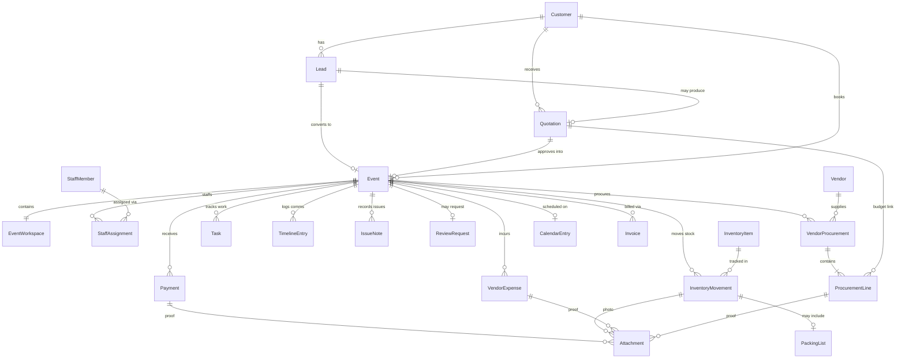

# Event OS Domain Model

## Document Metadata

| Field | Value |
|-------|-------|
| **Document Owner** | Founding Engineering |
| **Primary Reviewer** | Ilyas + Zakir (We Decor Events) |
| **Status** | Draft — founder review |
| **Version** | 1.0 |
| **Created Date** | 2026-07-08 |
| **Last Updated** | 2026-07-08 |
| **Next Review Date** | Not Defined |
| **Document Purpose** | Define the **Phase 1 business domain model** that sits between the approved business requirements ([`docs/business/19-event-os-phase1-requirements.md`](../docs/business/19-event-os-phase1-requirements.md)) and database/API design. Authoritative reference for aggregates, entities, relationships, and business invariants before schema or API work begins. |

---

## Version History

| Version | Date | Author | Summary of Changes |
|---------|------|--------|-------------------|
| 1.0 | 2026-07-08 | Founding Engineering | Initial Phase 1 domain model derived from Doc `19`, Business Bible `01`–`18`, aligned architecture docs, ADR-016, ADR-017 |

---

## Purpose of This Document

This document defines **what exists in the We Decor Phase 1 domain** — aggregates, entities, value objects, relationships, and invariants — without prescribing persistence, APIs, or UI.

| Layer | Document | Responsibility |
|-------|----------|----------------|
| Business requirements | [`docs/business/19-event-os-phase1-requirements.md`](../docs/business/19-event-os-phase1-requirements.md) | **What** We Decor needs (frozen scope) |
| **Domain model (this doc)** | `07-domain-model.md` | **Conceptual model** — aggregates, lifecycle, invariants |
| Module boundaries | [`06-module-design.md`](./06-module-design.md) | Engineering module ownership |
| Architecture | [`05-system-architecture.md`](./05-system-architecture.md) | System structure and policies |
| Database design | [`07-database-philosophy.md`](./07-database-philosophy.md) | Persistence strategy *(next step after this doc)* |

**This document does not define:** database tables, API endpoints, DTOs, repository interfaces, UI, or application service implementations.

---

## Scope

### In scope (Phase 1)

All domain concepts required to satisfy **59 committed EP1 IDs** and must-pass workflows **W1–W5** in Doc `19`, including:

- Unified event lifecycle (lead → quotation → approved event → operations → completion)
- Event operations workspace, execution tracking, and checklists
- Staff master, assignment recommendations, and movement permissions
- Vendor master, per-event procurement, payments, and variance flags
- Inventory master, event movement states, packing lists, returns
- Customer payments, vendor expenses, event profitability
- Communication timeline, issue notes, review request tracking
- Recommendation-only automation (suggestions — not auto-execution)
- Single-tenant We Decor org boundary

### Out of scope (deferred)

See [Future (Deferred) Domain Concepts](#future-deferred-domain-concepts). No new Phase 1 capabilities are introduced here.

### Terminology note

| Business / domain term | Engineering module term | Notes |
|------------------------|-------------------------|-------|
| **Customer** | CRM **Client** | Doc `19` uses *customer*; [`06-module-design.md`](./06-module-design.md) uses *Client* |
| **Event** | **Booking** (event hub) | Unified event record (`EP1-AUT-006`); Booking module owns the Event aggregate |
| **Domain event** (messaging) | — | Not to be confused with a We Decor **occasion** |

Ubiquitous language reference: [`13-glossary.md`](./13-glossary.md), [`04-business-domain.md`](./04-business-domain.md) *(generic platform terms; Phase 1 detail is authoritative in this document)*.

---

## References

| Document | Role |
|----------|------|
| [`docs/business/19-event-os-phase1-requirements.md`](../docs/business/19-event-os-phase1-requirements.md) | **Frozen Phase 1 business baseline** — EP1 IDs, UAT W1–W5 |
| [`docs/business/02-business-model.md`](../docs/business/02-business-model.md) | Sales pipeline, advance-before-Approved (BR-04) |
| [`docs/business/04-sales-process.md`](../docs/business/04-sales-process.md) | Sales lifecycle, quotation practices |
| [`docs/business/05-event-execution.md`](../docs/business/05-event-execution.md) | Operations lifecycle Approved → Completed |
| [`docs/business/06-staff-management.md`](../docs/business/06-staff-management.md) | Staffing model (v1.0 approved) |
| [`docs/business/07-vendor-management.md`](../docs/business/07-vendor-management.md) | Procurement workflow, variance, issue notes |
| [`docs/business/08-inventory-workflow.md`](../docs/business/08-inventory-workflow.md) | Movement states, packing, taxonomy |
| [`docs/business/09-finance-workflow.md`](../docs/business/09-finance-workflow.md) | Payments, expenses, profitability |
| [`docs/business/12-customer-support.md`](../docs/business/12-customer-support.md) | Timeline, issue notes, review requests |
| [`docs/business/14-business-rules.md`](../docs/business/14-business-rules.md) | Hard blocks, provisional rules |
| [`docs/business/17-automation-opportunities.md`](../docs/business/17-automation-opportunities.md) | No auto-execution policy |
| [`05-system-architecture.md`](./05-system-architecture.md) | Event workspace, automation policy |
| [`06-module-design.md`](./06-module-design.md) | Module ownership |
| [`12-architecture-decisions.md`](./12-architecture-decisions.md) | **ADR-016** (tenancy), **ADR-017** (suggestion-only handlers) |

---

## Domain Overview

Phase 1 centres on a **unified Event** that progresses from sales intake through operational execution to financial completion. The Event is the operational source of truth once sales reaches **Approved** (advance confirmed per [`02-business-model.md`](../docs/business/02-business-model.md) BR-04).

```
Sales phase                          Operations phase                    Close
───────────                          ────────────────                    ─────

Lead ──▶ Quotation ──▶ Event (Approved)
                           │
                           ├── Event Workspace (ops hub)
                           ├── Staff Assignments
                           ├── Vendor Procurement
                           ├── Inventory Movements
                           ├── Tasks / Checklists
                           ├── Timeline / Issues
                           └── Payments / Expenses ──▶ Completed
```

**Principles (non-negotiable, Doc `19` §2):**

- All automation **suggests**; nothing **auto-executes** (`EP1-AUT-001`)
- Human approval before customer comms, vendor actions, staff assignment, pricing, execution (`EP1-AUT-005`)
- Provisional rules **warn/recommend** only (`EP1-BR-004`)
- WhatsApp may continue externally; Event OS is **source of truth** for status, tasks, approvals, tracking

---

## Bounded Contexts

Each context owns its aggregates. Cross-context references use aggregate root IDs only.

| Bounded context | Aggregates (Phase 1) | Primary EP1 areas |
|-----------------|----------------------|-------------------|
| **CRM / Customer** | Customer, TimelineEntry, IssueNote, ReviewRequest | EP1-CUS, EP1-SUP |
| **Lead / Sales** | Lead, FollowUp | EP1-SAL |
| **Quotation** | Quotation | EP1-FIN-001 |
| **Event / Operations** | **Event**, EventWorkspace | EP1-OPS, EP1-AUT-002, EP1-AUT-006, EP1-BR-003 |
| **Task** | Task, ChecklistTemplate | EP1-OPS-003, EP1-AUT-003 |
| **Staff** | StaffMember, StaffAssignment | EP1-STF |
| **Vendor** | Vendor, VendorProcurement, ProcurementLine | EP1-VEN |
| **Inventory** | InventoryItem, InventoryMovement, PackingList | EP1-INV |
| **Finance** | Invoice, Payment, VendorExpense, EventProfitabilityView | EP1-FIN, EP1-BR-001–002 |
| **Calendar** | CalendarEntry | EP1-OPS-005 |
| **Platform** | Suggestion, Attachment (metadata), MovementPermission | EP1-AUT, EP1-STF-003 |
| **BI** | FounderKpiSnapshot *(read model)* | EP1-KPI, EP1-MKT-001–002 |

```
┌─────────────┐     ┌─────────────┐     ┌──────────────┐
│  Customer   │◀────│    Lead     │────▶│  Quotation   │
│   (CRM)     │     │   (Sales)   │     │              │
└──────┬──────┘     └─────────────┘     └──────┬───────┘
       │                                         │
       │              ┌──────────────────────────┘
       │              ▼
       │     ┌─────────────────────────────────────────────┐
       └────▶│              Event (root)                  │
             │  ┌─────────────────────────────────────┐  │
             │  │         Event Workspace              │  │
             │  │  StaffAssignment · Procurement ·     │  │
             │  │  InventoryMovement · Task · Timeline │  │
             │  └─────────────────────────────────────┘  │
             └──────────┬──────────────────────────────────┘
                        │
         ┌──────────────┼──────────────┬─────────────┐
         ▼              ▼              ▼             ▼
    ┌─────────┐   ┌──────────┐   ┌──────────┐  ┌─────────┐
    │ Finance │   │ Calendar │   │  Vendor  │  │Inventory│
    │Payment  │   │  Entry   │   │ (master) │  │ (master)│
    │Expense  │   └──────────┘   └──────────┘  └─────────┘
    └─────────┘
```

---

## Relationship Diagram



---

## Aggregate Ownership

Rules for cross-aggregate references:

| Rule | Description |
|------|-------------|
| **Root-only references** | Other contexts reference `eventId`, `customerId`, `leadId`, etc. — never internal entities |
| **Single write owner** | Each entity is mutated only by its owning aggregate's application service |
| **Event hub** | Operational entities (assignments, procurement, movements) reference `eventId` |
| **No shared mutable state** | Contexts do not query another context's tables directly |

---

## Value Objects

Shared kernel value objects used across aggregates:

| Value object | Purpose | Invariants |
|--------------|---------|------------|
| **Money** | Amount + currency | Same-currency arithmetic only; no floating point |
| **DateRange** | Event dates, allocation periods | `end` ≥ `start` |
| **PhoneNumber** | Customer, staff, vendor contact | Validated; normalized E.164 |
| **Email** | Contact reachability | Validated format; lowercase normalized |
| **Address** | Venue, vendor location | — |
| **Venue** | Event location | Name required; optional address/capacity |
| **AttachmentRef** | Link to stored file | Points to platform Attachment; tenant-scoped |
| **LeadSource** | Channel taxonomy | Aligned to EP1-SAL-002 (`website`, `instagram`, `whatsapp`, `referral`, `walk_in`, `phone`, `manual`, `other`) |
| **PreparationStatus** | Ops visibility (UAT Z1) | `pending`, `ready`, `needs_attention` |

---

## Aggregates

The sections below define each aggregate. Legend:

| Symbol | Meaning |
|--------|---------|
| **AR** | Aggregate root |
| **E** | Entity owned by this aggregate |
| **VO** | Value object |
| **REF** | Reference to another aggregate (by ID only) |

---

### Customer

**Bounded context:** CRM / Customer  
**Module:** CRM (`06-module-design.md`)

#### Purpose

Single customer identity across lead, quotation, and event lifecycle (`EP1-CUS-001`). Eliminates duplicate customer data between Lead Management Application and Quotation/Billing Application.

#### Structure

| Kind | Name | Description |
|------|------|-------------|
| **AR** | Customer | Person or organization engaging We Decor |
| **E** | Contact | Individuals associated with the customer (bride, event manager, etc.) |
| **VO** | PhoneNumber, Email, Address | Contact reachability |

#### Lifecycle

```
created → active ⇄ inactive
              └→ blocked
```

- Created on first lead capture or manual entry
- Linked when lead converts; reused across quotations and events
- Status changes are manual (no auto-block)

#### Business invariants

- Belongs to exactly one tenant ([ADR-016](./12-architecture-decisions.md#adr-016-phase-1-single-tenant-mode-we-decor))
- At least one Contact with phone or email
- Display name unique per tenant (case-insensitive)
- Customer merge requires human action (no auto-merge)

#### Related EP1 IDs

| ID | Capability |
|----|------------|
| EP1-CUS-001 | Unified customer profile |
| EP1-SUP-* | Support view aliases customer capabilities |

#### Workflow coverage

| Workflow | Role |
|----------|------|
| **W5** | Customer identity carries forward without duplicate entry |
| **W1–W4** | Customer context on event record |

---

### Lead

**Bounded context:** Lead / Sales  
**Module:** Lead

#### Purpose

Sales pipeline from enquiry through booking readiness. Extends Lead Management Application patterns — **not** a greenfield CRM rebuild (`EP1-SAL-003`, W5 UAT).

#### Structure

| Kind | Name | Description |
|------|------|-------------|
| **AR** | Lead | Sales opportunity |
| **E** | FollowUp | Structured follow-up date/task (`EP1-SAL-005`) |
| **E** | LeadStageHistory | Audit of pipeline transitions |
| **REF** | Customer | `customerId` when identified |
| **REF** | StaffMember | `assignedTo` sales assignee |

#### Lifecycle — sales pipeline

Per [`02-business-model.md`](../docs/business/02-business-model.md) and Doc `19` (reuse LM):

```
New → In Talks → Approved → Completed
         │
         └──→ Lost / Cancelled (exit)
```

| Stage | Business meaning | Source |
|-------|------------------|--------|
| **New** | Enquiry captured | `02` pipeline |
| **In Talks** | Requirements, design, quotation, negotiation, follow-up | `02` BR-03, `04` |
| **Approved** | Advance payment (~20%) verified — booking confirmed | `02` BR-04 |
| **Completed** | Event successfully executed and closed | `02` pipeline |
| **Lost / Cancelled** | Exit statuses | `02` |

#### Business invariants

- Transition to **Approved** blocked until advance payment confirmed — **EP1-BR-001** (see [`14-business-rules.md`](../docs/business/14-business-rules.md))
- `lostReason` required when moving to Lost
- `assignedTo` references active staff of same tenant
- Lead source recorded per EP1-SAL-002 taxonomy
- Conversion to Event requires Approved stage without duplicate customer re-entry (`EP1-AUT-006`)

#### Related EP1 IDs

| ID | Capability |
|----|------------|
| EP1-SAL-001 | Lead capture (all channels) |
| EP1-SAL-002 | Lead source taxonomy |
| EP1-SAL-003 | Pipeline / status |
| EP1-SAL-004 | Lead assignment |
| EP1-SAL-005 | Structured follow-ups |
| EP1-SAL-006 | Sales notifications (with approval guardrails) |
| EP1-MKT-004 | Website intake |
| EP1-BR-001 | Advance before Approved |
| EP1-AUT-006 | Unified event record (conversion) |

#### Workflow coverage

| Workflow | Role |
|----------|------|
| **W5** | Full lead → approved event without duplicate entry |
| **W1** | Approved triggers event/workspace creation |

---

### Quotation

**Bounded context:** Quotation  
**Module:** Quotation

#### Purpose

Event-linked price proposal with line items and PDF (`EP1-FIN-001`). Reuses Quotation/Billing Application GST/PDF patterns during parallel-run transition.

#### Structure

| Kind | Name | Description |
|------|------|-------------|
| **AR** | Quotation | Formal price proposal |
| **E** | QuotationLineItem | Priced line; budget anchor for procurement (`07` procurement linkage) |
| **REF** | Customer | `customerId` |
| **REF** | Lead | `leadId` (optional) |
| **REF** | Event | `eventId` once linked post-approval |

#### Lifecycle

```
draft → sent → approved
          │        │
          ├→ rejected
          ├→ expired
          └→ superseded (on revision)
```

**Phase 1 note:** Structured customer approval portal is **deferred** — manual WhatsApp approval is acceptable per Doc `19` and `04`. Internal `approved` status is recorded by staff after off-channel confirmation.

#### Business invariants

- Only `draft` quotations are editable
- `sent` requires at least one line item with total > 0
- `approved` is terminal for a version; revisions create new version
- Line totals computed — not manually overridden
- Quotation number unique per tenant
- Approved quotation is prerequisite for Event creation (1:1 per approved quote)

#### Related EP1 IDs

| ID | Capability |
|----|------------|
| EP1-FIN-001 | Event-linked quotations + line items |
| EP1-AUT-006 | Part of unified event chain |
| EP1-VEN-002 | Line items anchor procurement budget |

#### Workflow coverage

| Workflow | Role |
|----------|------|
| **W5** | Quotation linked to lead/customer |
| **W3** | Line items compared to actual procurement |
| **W4** | Revenue input to profitability |

---

### Event

**Bounded context:** Event / Operations  
**Module:** Booking (event hub per `06-module-design.md`)

#### Purpose

**Unified event record** (`EP1-AUT-006`) — operational source of truth from Approved through Completed. Anchors workspace, staff, vendor, inventory, finance, and customer support data for one We Decor occasion.

#### Structure

| Kind | Name | Description |
|------|------|-------------|
| **AR** | **Event** | Root of unified event lifecycle |
| **E** | EventWorkspace | Operational hub (see below) |
| **E** | ExecutionProgress | Operational tracking beyond sales pipeline (`EP1-OPS-004`) |
| **VO** | EventDetails | Type, dates, venue, guest count, requirements |
| **REF** | Customer | `customerId` |
| **REF** | Quotation | `quotationId` |
| **REF** | Lead | `leadId` (provenance) |
| **REF** | StaffMember | `executionOwnerId` (`EP1-BR-003`) |

#### Lifecycle

```
[created at Approved] → in_preparation → in_execution → completed
                              │                              │
                              └──────── cancelled ─────────────┘
```

| Phase | Description | Source |
|-------|-------------|--------|
| **Approved** | Advance confirmed; event record active; workspace activation eligible | `02` BR-04, `05` EX-02 |
| **In preparation** | Procurement, inventory, staff, checklists in progress | W1, W2, W3 |
| **In execution** | On-site / event-day operations | `05` event day |
| **Completed** | Execution and financial review done | `05` EX-09, EP1-BR-002 |
| **Cancelled** | Exceptional post-approval cancel | `02`, `05` IR-05 |

Sales pipeline **Approved** on Lead aligns with Event creation; subsequent status is **operational**, not a repeat of sales stages.

#### ExecutionProgress (owned entity)

Tracks operational progress **beyond** the sales pipeline (`EP1-OPS-004`):

| Attribute | Purpose | Source |
|-----------|---------|--------|
| `preparationStatus` | `pending` \| `ready` \| `needs_attention` | UAT Z1 (Doc `19` §10) |
| `operationalMilestone` | Configurable ops milestone on event record | [`05-system-architecture.md`](./05-system-architecture.md) Event Workspace — *illustrative values: preparation, setup, event day, teardown, closed* |
| `executionOwnerId` | Responsible operator before execution proceeds | EP1-BR-003, `14` |

*Operational milestone labels are tenant-configurable operational tracking — not sales pipeline stages. Initial We Decor values follow approved architecture; no additional stages are introduced beyond Doc `19` scope.*

#### Business invariants

- Created only from **Approved** quotation with advance confirmed — **EP1-BR-001**
- One Event per approved quotation (1:1)
- **Execution owner** assigned before execution milestones advance — **EP1-BR-003** ([`14-business-rules.md`](../docs/business/14-business-rules.md))
- Transition to **Completed** blocked until financial review satisfied — **EP1-BR-002**
- Event dates cannot move to past without authorized override
- Cancellation requires reason; triggers downstream cleanup (tasks, movements)
- Event record is authoritative over external channels (WhatsApp) for status/tasks/approvals

#### Related EP1 IDs

| ID | Capability |
|----|------------|
| EP1-AUT-006 | Unified event record |
| EP1-OPS-001 | Event workspace at Approved |
| EP1-OPS-004 | Execution stage tracking |
| EP1-OPS-005 | Event dates / calendar linkage |
| EP1-BR-002 | Financial review before Completed |
| EP1-BR-003 | Execution ownership before execution |
| EP1-AUT-002 | Workspace suggestion at Approved |

#### Workflow coverage

| Workflow | Role |
|----------|------|
| **W1** | Central hub for approved → execution |
| **W2–W4** | Anchors inventory, procurement, finance |
| **W5** | Target of lead conversion |

---

### Event Workspace

**Bounded context:** Event / Operations  
**Owned by:** Event aggregate (not a separate aggregate root)

#### Purpose

Operational hub activated at **Approved Event** (`EP1-OPS-001`). Aggregates cross-module **views and links** for one event — staff, vendors, inventory, tasks, finance visibility — without duplicating domain ownership of child aggregates.

#### Structure

| Kind | Name | Description |
|------|------|-------------|
| **E** | EventWorkspace | 1:1 with Event |
| **REF** | StaffAssignment | Collection via `eventId` |
| **REF** | VendorProcurement | Collection via `eventId` |
| **REF** | InventoryMovement | Collection via `eventId` |
| **REF** | Task | Collection via `eventId` |
| **REF** | Payment, VendorExpense | Financial summary refs |
| **REF** | TimelineEntry, IssueNote | Customer support refs |

#### Lifecycle

```
inactive → active → archived
```

| Status | Meaning |
|--------|---------|
| **inactive** | Event approved; workspace not yet confirmed |
| **active** | Workspace confirmed; operational planning underway |
| **archived** | Event completed or cancelled; read-only |

**Human confirmation:** Workspace activation follows suggestion-only policy — `QuotationApproved` / Approved transition may produce a **Suggestion** (`EP1-AUT-002`); Zakir confirms activation ([ADR-017](./12-architecture-decisions.md#adr-017-phase-1-domain-event-handlers-suggestion-only)).

#### Business invariants

- At most one workspace per Event
- Workspace becomes **active** only by explicit human confirmation (not domain event auto-create)
- Modules retain ownership of child aggregates; workspace does not mutate them directly
- Financial visibility is read-only aggregation from Finance context

#### Related EP1 IDs

| ID | Capability |
|----|------------|
| EP1-OPS-001 | Event operations workspace |
| EP1-AUT-002 | Human-confirmed creation |
| EP1-FIN-005 | Profitability visible on workspace |
| EP1-FIN-003 | Payment status visible |

#### Workflow coverage

| Workflow | Role |
|----------|------|
| **W1** | Zakir's single pane for approved events (Z1) |
| **W2–W4** | Coordinates prep, procurement, payments |

---

### Staff Assignment

**Bounded context:** Staff  
**Module:** Staff (+ Event reference)

#### Purpose

Record which staff are assigned to an event. Phase 1 includes **recommendation** flow — system suggests; Zakir approves (`EP1-STF-002`, `EP1-AUT-004`).

#### Structure

| Kind | Name | Description |
|------|------|-------------|
| **E** | StaffAssignment | Staff member linked to event with role/note |
| **REF** | Event | `eventId` |
| **REF** | StaffMember | `staffMemberId` |

*StaffMember is a separate aggregate (staff master). StaffAssignment is owned by Event or Staff context — referenced from Event; mutations go through Staff application service.*

#### Lifecycle

```
proposed → confirmed → released
              └→ cancelled
```

| Status | Meaning |
|--------|---------|
| **proposed** | Recommendation pending Zakir approval |
| **confirmed** | Zakir approved assignment |
| **released** | Event complete; assignment closed |
| **cancelled** | Assignment withdrawn |

#### Business invariants

- Confirmation requires human approval — no auto-assign (`EP1-AUT-001`, `17` AO-03)
- `staffMemberId` must reference active StaffMember
- Assignment changes on active events require authorized role

#### Related EP1 IDs

| ID | Capability |
|----|------------|
| EP1-STF-002 | Staff assignment recommendations |
| EP1-AUT-004 | Automation view of assignment recommendations |
| EP1-STF-001 | Staff master (referenced) |

#### Workflow coverage

| Workflow | Role |
|----------|------|
| **W1** | Staff coordination from workspace (Z3) |

---

### StaffMember

**Bounded context:** Staff  
**Module:** Staff

#### Purpose

Staff master aligned to We Decor staffing model ([`06-staff-management.md`](../docs/business/06-staff-management.md) v1.0): 2 permanent decorators + trusted temporary pool.

#### Structure

| Kind | Name | Description |
|------|------|-------------|
| **AR** | StaffMember | Decorator profile |
| **REF** | User | Optional auth link |

#### Lifecycle

```
active ⇄ inactive
    └→ on_leave
```

#### Business invariants

- Belongs to one tenant
- Name and primary phone required
- Inactive staff cannot receive new confirmed assignments

#### Related EP1 IDs

EP1-STF-001, EP1-STF-003 (movement permissions via platform)

---

### Vendor

**Bounded context:** Vendor  
**Module:** Vendor

#### Purpose

Vendor directory with preferred/backup status and lightweight issue history (`EP1-VEN-001`, `EP1-VEN-006`).

#### Structure

| Kind | Name | Description |
|------|------|-------------|
| **AR** | Vendor | External supplier |
| **E** | VendorIssueNote | Vendor-level feedback note (lightweight) |
| **VO** | Contact, LeadSource category | Vendor category taxonomy per `07` |

#### Lifecycle

```
active ⇄ inactive
    └→ paused / blocked (with reason note)
```

#### Business invariants

- Vendor name required; category required
- Paused/blocked status should capture reason via VendorIssueNote
- Preferred/backup is classification, not a separate aggregate

#### Related EP1 IDs

EP1-VEN-001, EP1-VEN-006

---

### Vendor Procurement

**Bounded context:** Vendor  
**Module:** Vendor

#### Purpose

Per-event procurement tracking from requirement through completion and payment (`EP1-VEN-002`–`006`, W3).

#### Structure

| Kind | Name | Description |
|------|------|-------------|
| **AR** | VendorProcurement | Procurement header per event (or per event-vendor grouping) |
| **E** | ProcurementLine | Line item: material/service, vendor, budget link, status |
| **E** | ProcurementLineIssueNote | Line-level issue note |
| **REF** | Event | `eventId` |
| **REF** | Vendor | `vendorId` |
| **REF** | QuotationLineItem | Budget comparison (`07` procurement linkage) |
| **REF** | VendorExpense | Payment linkage |

#### Lifecycle — procurement line

Per Doc `19` and [`07-vendor-management.md`](../docs/business/07-vendor-management.md):

```
Planned → Requested → Confirmed → Delivered → Completed
```

| State | Meaning | Source |
|-------|---------|--------|
| **Planned** | Requirement identified | `07`, `19` |
| **Requested** | Order communicated to vendor | `07` |
| **Confirmed** | Vendor accepted | `07` |
| **Delivered** | Materials delivered (category-dependent) | `07` |
| **Completed** | Service/on-site work complete (category-dependent) | `07` |

*Some categories use Delivered only, Completed only, or both checkpoints on the same line per `07` category mapping.*

#### Business invariants

- Linked to Event and optionally to QuotationLineItem for budget comparison
- Confirmation and status advances require human action (`EP1-AUT-005`, `07` VM-02)
- Cost variance flagged when actual exceeds budget — **EP1-VEN-005**; reason required per `07`
- Variance review recommended before Event **Completed** (`07` cost variance flag)
- Vendor payment tracking references procurement lines (`EP1-VEN-004`)

#### Related EP1 IDs

EP1-VEN-002, EP1-VEN-003, EP1-VEN-004, EP1-VEN-005, EP1-VEN-006

#### Workflow coverage

| Workflow | Role |
|----------|------|
| **W3** | Full procurement cycle |
| **W4** | Expense input to profitability |

---

### InventoryItem

**Bounded context:** Inventory  
**Module:** Inventory

#### Purpose

Inventory master with reusable / consumable / per-event taxonomy (`EP1-INV-001`). Quantity at JP Nagar location (`EP1-INV-002`).

#### Structure

| Kind | Name | Description |
|------|------|-------------|
| **AR** | InventoryItem | Tracked material or asset |
| **VO** | ItemTaxonomy | `reusable`, `consumable`, `per_event` |
| **E** | LocationQuantity | Stock at JP Nagar (Phase 1 single location) |

#### Lifecycle

```
active → retired
```

#### Business invariants

- Taxonomy classification required
- `quantityAvailable` ≥ 0 at all times
- Location quantity tracked at JP Nagar for Phase 1

#### Related EP1 IDs

EP1-INV-001, EP1-INV-002

---

### Inventory Movement

**Bounded context:** Inventory  
**Module:** Inventory

#### Purpose

Per-event stock movement through preparation and return (`EP1-INV-003`–`007`, W2).

#### Structure

| Kind | Name | Description |
|------|------|-------------|
| **AR** | InventoryMovement | Movement of one item for one event |
| **E** | PackingList | Generated checklist of items to pack (`EP1-INV-004`) |
| **E** | PackingListLine | Item + quantity on packing list |
| **E** | DamageNote | Accountability for damage/loss (`EP1-INV-006`) |
| **REF** | Event | `eventId` |
| **REF** | InventoryItem | `inventoryItemId` |
| **REF** | Attachment | Movement photos (`EP1-INV-007`) |

#### Lifecycle — movement state machine

Per Doc `19` and [`08-inventory-workflow.md`](../docs/business/08-inventory-workflow.md):

```
Planned → Picked → Packed → Loaded → At Venue → Returned → Cleaned/Ready
```

| State | Meaning |
|-------|---------|
| **Planned** | Item identified for event |
| **Picked** | Taken from storage |
| **Packed** | Prepared for transport |
| **Loaded** | Loaded for transport |
| **At Venue** | On site |
| **Returned** | Back from venue |
| **Cleaned/Ready** | Available for reuse |

#### Business invariants

- State transitions are **human-initiated** (movement permissions per EP1-STF-003)
- Cannot allocate more than available quantity
- Packing list generation may produce **Suggestion** for human review (`EP1-AUT-003`, ADR-017)
- Returns workflow required before item marked Cleaned/Ready
- Damage/loss requires accountability note

#### Related EP1 IDs

EP1-INV-003, EP1-INV-004, EP1-INV-005, EP1-INV-006, EP1-INV-007, EP1-AUT-003

#### Workflow coverage

| Workflow | Role |
|----------|------|
| **W2** | Full inventory movement cycle (Z4) |

---

### Task

**Bounded context:** Task  
**Module:** Task

#### Purpose

Event-linked execution checklists and operational tasks (`EP1-OPS-003`). Supports SOP structure from [`13-standard-operating-procedures.md`](../docs/business/13-standard-operating-procedures.md) without formal SOP content library in Phase 1.

#### Structure

| Kind | Name | Description |
|------|------|-------------|
| **AR** | Task | Unit of work with assignee and due date |
| **E** | ChecklistItem | Sub-item when task represents checklist row |
| **REF** | Event | `eventId` |
| **REF** | StaffMember | `assignedTo` |

#### Lifecycle

```
pending → in_progress → completed
              └→ cancelled
```

#### Business invariants

- `completedAt` set when status → completed
- Tasks on cancelled events are cancelled
- Checklist generation from template produces **Suggestion** until confirmed (ADR-017)
- Completion recorded in Event OS as source of truth (Z2)

#### Related EP1 IDs

EP1-OPS-003, EP1-AUT-003

#### Workflow coverage

| Workflow | Role |
|----------|------|
| **W1** | Execution checklists (Z2) |
| **W2** | Packing/preparation tasks |

---

### Timeline

**Bounded context:** CRM / Customer  
**Module:** CRM

#### Purpose

Per-event **communication timeline** — records of significant interactions (`EP1-CUS-002`). **Not** a WhatsApp replacement; external messaging may continue.

#### Structure

| Kind | Name | Description |
|------|------|-------------|
| **E** | TimelineEntry | Single recorded interaction or note |
| **REF** | Event | `eventId` |
| **REF** | Customer | `customerId` |
| **REF** | StaffMember | `recordedBy` |

*Timeline entries are owned by Customer/Event adjunct; exposed on Event Workspace.*

#### Lifecycle

```
recorded → (immutable)
```

#### Business invariants

- Append-oriented — edits are corrections with audit, not silent mutation
- Must reference an Event in Phase 1
- Does not auto-capture WhatsApp messages

#### Related EP1 IDs

EP1-CUS-002, EP1-SUP-001

---

### Issue

**Bounded context:** CRM / Customer (+ Vendor for vendor issues)  
**Module:** CRM, Vendor

#### Purpose

Lightweight issue/complaint notes — **not** a ticketing system (`EP1-CUS-004`, `12` Phase 1 scope).

#### Structure

| Kind | Name | Description |
|------|------|-------------|
| **E** | IssueNote | Customer issue per event |
| **E** | VendorIssueNote | Vendor or procurement-line issue (see Vendor aggregates) |
| **REF** | Event | `eventId` |
| **REF** | Customer | `customerId` (customer issues) |

#### Lifecycle

```
open → resolved
```

#### Business invariants

- No SLA, routing, or escalation workflow in Phase 1
- Resolution is manual status + optional note
- Vendor issues may exist at vendor level and procurement line level (`07`)

#### Related EP1 IDs

EP1-CUS-004, EP1-SUP-002, EP1-VEN-006

---

### ReviewRequest

**Bounded context:** CRM / Customer  
**Module:** Lead + CRM

#### Purpose

Track Google/Instagram/website review requests ported from Lead Management Application (`EP1-CUS-003`).

#### Structure

| Kind | Name | Description |
|------|------|-------------|
| **E** | ReviewRequest | Review ask sent/tracked per event |
| **REF** | Event | `eventId` |
| **REF** | Customer | `customerId` |

#### Lifecycle

```
pending → sent → (acknowledged | skipped)
```

#### Business invariants

- Sending review message requires human action (reuse LM pattern)
- Not required for every completed event (`12` — timing Not Defined)

#### Related EP1 IDs

EP1-CUS-003, EP1-SUP-003

---

### Payment

**Bounded context:** Finance  
**Module:** Finance

#### Purpose

Customer advance and balance payment records with optional proof attachments (`EP1-FIN-003`).

#### Structure

| Kind | Name | Description |
|------|------|-------------|
| **AR** | Payment | Money received from customer |
| **REF** | Event | `eventId` |
| **REF** | Invoice | `invoiceId` (when invoiced) |
| **REF** | Attachment | Optional proof |
| **VO** | Money, PaymentMethod | `cash`, `upi`, `bank_transfer`, `card`, `cheque`, `other` |

#### Lifecycle

```
recorded → (void)
```

#### Business invariants

- Advance confirmation gates Lead/Event **Approved** — **EP1-BR-001** ([`02-business-model.md`](../docs/business/02-business-model.md) BR-04)
- Proof attachment optional but recommended; missing proof allowed with reason (`09`)
- Payment amount cannot exceed outstanding balance
- Recording is human-initiated

#### Related EP1 IDs

EP1-FIN-003, EP1-BR-001

#### Workflow coverage

| Workflow | Role |
|----------|------|
| **W4** | Customer payment → financial completion |
| **W5** | Advance enables Approved |

---

### VendorExpense

**Bounded context:** Finance  
**Module:** Finance

#### Purpose

Vendor and event expenses for profitability (`EP1-FIN-004`).

#### Structure

| Kind | Name | Description |
|------|------|-------------|
| **AR** | VendorExpense | Expense line per event |
| **REF** | Event | `eventId` |
| **REF** | ProcurementLine | Optional link |
| **REF** | Vendor | `vendorId` |
| **REF** | Attachment | Bill / UPI proof |

#### Lifecycle

```
recorded → (void)
```

#### Business invariants

- Must link to Event
- Human-recorded; no auto vendor payments (`19` scope freeze)
- Contributes to event profitability view

#### Related EP1 IDs

EP1-FIN-004, EP1-FIN-005, EP1-VEN-004

#### Workflow coverage

| Workflow | Role |
|----------|------|
| **W3** | Vendor payment tracking |
| **W4** | Expense side of profitability (Z5, I5) |

---

### Invoice

**Bounded context:** Finance  
**Module:** Finance

#### Purpose

Event-linked billing and invoices (`EP1-FIN-002`). Extends Quotation/Billing Application patterns.

#### Structure

| Kind | Name | Description |
|------|------|-------------|
| **AR** | Invoice | Bill to customer |
| **E** | InvoiceLineItem | Billed lines |
| **REF** | Event | `eventId` |
| **REF** | Customer | `customerId` |

#### Lifecycle

```
draft → sent → partially_paid → paid
          └→ void
```

#### Business invariants

- Linked to Event and Customer
- Payment totals update invoice status
- Void invoices cannot receive payments

#### Related EP1 IDs

EP1-FIN-002

---

### Attachment

**Bounded context:** Platform  
**Module:** File

#### Purpose

Domain representation of uploaded files — payment proofs, inventory photos, decor media, vendor bills (`EP1-FIN-003`, `EP1-INV-007`, `EP1-MKT-003`).

#### Structure

| Kind | Name | Description |
|------|------|-------------|
| **AR** | Attachment | File metadata (blob in object storage) |
| **REF** | Parent entity | Polymorphic link to Payment, Movement, Expense, Event (content library) |
| **VO** | AttachmentRef | Lightweight pointer used in other aggregates |

#### Lifecycle

```
uploaded → deleted (soft)
```

#### Business invariants

- Tenant-scoped storage path ([ADR-016](./12-architecture-decisions.md#adr-016-phase-1-single-tenant-mode-we-decor))
- Access via signed URL pattern (architecture doc)
- Deletion cascades from parent entity policy

#### Related EP1 IDs

EP1-FIN-003, EP1-INV-007, EP1-MKT-003

---

### Suggestion

**Bounded context:** Platform (policy layer)  
**Module:** Cross-cutting

#### Purpose

Persisted recommendation awaiting human accept/dismiss ([ADR-017](./12-architecture-decisions.md#adr-017-phase-1-domain-event-handlers-suggestion-only)). Implements `EP1-AUT-001`–`004` without auto-execution.

#### Structure

| Kind | Name | Description |
|------|------|-------------|
| **AR** | Suggestion | Proposed action |
| **REF** | Target aggregate | `aggregateType` + `aggregateId` |

#### Lifecycle

```
pending → accepted | dismissed | expired
```

#### Business invariants

- Handlers create Suggestions — never execute business mutations directly (ADR-017)
- Accept delegates to target module application service
- Types include: `workspace.create`, `checklist.generate`, `staff.assign`, `calendar.milestone`

#### Related EP1 IDs

EP1-AUT-001, EP1-AUT-002, EP1-AUT-003, EP1-AUT-004, EP1-AUT-005

---

### CalendarEntry

**Bounded context:** Calendar  
**Module:** Calendar

#### Purpose

Event dates and operations milestones on unified calendar (`EP1-OPS-005`).

#### Structure

| Kind | Name | Description |
|------|------|-------------|
| **AR** | CalendarEntry | Scheduled block |
| **REF** | Event | `eventId` |
| **REF** | Lead | `leadId` (site visits) |

#### Lifecycle

```
scheduled → completed | cancelled
```

#### Related EP1 IDs

EP1-OPS-005

---

### EventProfitabilityView

**Bounded context:** Finance / BI  
**Module:** Finance + BI (read model)

#### Purpose

Computed view: customer revenue − vendor expenses per event (`EP1-FIN-005`, `EP1-KPI-004`). Not a mutable aggregate — derived from Payment, Invoice, and VendorExpense.

#### Business invariants

- Read-only composition
- No fabricated KPI baselines (`19` §2)
- Updated when underlying payments/expenses change

#### Related EP1 IDs

EP1-FIN-005, EP1-KPI-004

---

## Domain Services

Domain services encapsulate logic that does not belong to a single entity:

| Domain service | Responsibility | EP1 refs |
|----------------|----------------|----------|
| **EventConversionService** | Lead + Approved quotation → Event + workspace suggestion | EP1-AUT-006, W5 |
| **BusinessRuleEnforcement** | Hard blocks BR-001–003; provisional warn-only BR-004 | EP1-BR-* |
| **ProcurementVarianceService** | Compare actual vs quotation budget; flag variance | EP1-VEN-005 |
| **ProfitabilityCalculation** | Revenue − vendor expenses per event | EP1-FIN-005 |
| **MovementPermissionPolicy** | Whether user may confirm inventory/procurement/finance actions | EP1-STF-003 |
| **SuggestionFactory** | Create suggestions from domain events (ADR-017) | EP1-AUT-001–004 |

*Interfaces and implementations belong to application/domain layers — not specified here.*

---

## Domain Events

Cross-module **domain events** notify other contexts of facts that already happened. Phase 1 handler behaviour is governed by **[ADR-017](./12-architecture-decisions.md#adr-017-phase-1-domain-event-handlers-suggestion-only)** — handlers produce **Suggestions** and **in-app alerts** only.

### Emitted events (illustrative, not exhaustive)

| Event | Emitted by | Typical Phase 1 handler outcome |
|-------|------------|--------------------------------|
| `LeadCreated` | Lead | Attribution, optional notification |
| `LeadStageChanged` | Lead | Pipeline analytics |
| `LeadConverted` | Lead | Customer link verification |
| `QuotationApproved` | Quotation | **Suggestion:** activate workspace, generate checklist draft |
| `EventWorkspaceActivated` | Event | Calendar entry suggestion |
| `StaffAssignmentConfirmed` | Staff | In-app alert (after human confirm) |
| `ProcurementLineStatusChanged` | Vendor | Workspace status refresh |
| `InventoryMovementStateChanged` | Inventory | Preparation status recalculation |
| `PaymentRecorded` | Finance | Approved gate satisfaction check |
| `EventCompleted` | Event | KPI read-model refresh |

**Rule:** No handler may auto-execute business actions listed in ADR-017 approval gates.

---

## Tenant Boundaries

Phase 1 tenant behaviour is defined in **[ADR-016](./12-architecture-decisions.md#adr-016-phase-1-single-tenant-mode-we-decor)**.

| Aspect | Phase 1 |
|--------|---------|
| **Tenants** | One seeded We Decor organisation |
| **Scoping** | Every aggregate carries `tenantId`; queries scoped via OrgContext |
| **Onboarding** | None |
| **Cross-tenant access** | Impossible by configuration (single tenant) |
| **RLS / isolation tests** | Deferred to Phase 6 SaaS |

---

## Existing System Ownership

Domain concepts that **reuse or extend** current We Decor systems during transition ([`11-roadmap.md`](./11-roadmap.md) Transitional Integrations):

| Current system | Domain concepts | Posture |
|----------------|-----------------|---------|
| **Lead Management Application** | Lead, sales pipeline, FollowUp, assignment, ReviewRequest, lead-source analytics | **Extend** — port patterns; do not rebuild sales core (W5) |
| **Quotation/Billing Application** | Quotation, QuotationLineItem, Invoice (offline) | **Parallel-run** — migrate PDF/GST patterns |
| **We Decor Website** | Lead capture (`LeadSource.website`) | **Integrate** — persist to Lead |
| **WhatsApp (external)** | Not modelled as aggregate | **Continue** — Timeline manual capture only |

Greenfield aggregates (no adequate current-system model): **Event**, **EventWorkspace**, **VendorProcurement**, **InventoryMovement**, **VendorExpense**, **TimelineEntry**, **IssueNote**, **StaffMember** (master), **Suggestion**.

---

## Traceability to EP1 Requirement IDs

| EP1 ID | Primary aggregate(s) |
|--------|----------------------|
| EP1-SAL-001 | Lead |
| EP1-SAL-002 | Lead (`LeadSource`) |
| EP1-SAL-003 | Lead |
| EP1-SAL-004 | Lead, StaffAssignment |
| EP1-SAL-005 | Lead (`FollowUp`) |
| EP1-SAL-006 | Lead, Suggestion (notification gates) |
| EP1-CUS-001 | Customer |
| EP1-CUS-002 | TimelineEntry |
| EP1-CUS-003 | ReviewRequest |
| EP1-CUS-004 | IssueNote |
| EP1-FIN-001 | Quotation |
| EP1-FIN-002 | Invoice |
| EP1-FIN-003 | Payment, Attachment |
| EP1-FIN-004 | VendorExpense |
| EP1-FIN-005 | EventProfitabilityView |
| EP1-OPS-001 | EventWorkspace |
| EP1-OPS-003 | Task |
| EP1-OPS-004 | ExecutionProgress |
| EP1-OPS-005 | CalendarEntry |
| EP1-STF-001 | StaffMember |
| EP1-STF-002 | StaffAssignment, Suggestion |
| EP1-STF-003 | MovementPermissionPolicy |
| EP1-VEN-001 | Vendor |
| EP1-VEN-002 | VendorProcurement, ProcurementLine |
| EP1-VEN-003 | ProcurementLine (state machine) |
| EP1-VEN-004 | VendorExpense |
| EP1-VEN-005 | ProcurementVarianceService |
| EP1-VEN-006 | VendorIssueNote, ProcurementLineIssueNote |
| EP1-INV-001 | InventoryItem |
| EP1-INV-002 | LocationQuantity |
| EP1-INV-003 | InventoryMovement |
| EP1-INV-004 | PackingList |
| EP1-INV-005 | InventoryMovement (Returned → Cleaned/Ready) |
| EP1-INV-006 | DamageNote |
| EP1-INV-007 | Attachment |
| EP1-MKT-001–002 | FounderKpiSnapshot (read model) |
| EP1-MKT-003 | Attachment (event content library) |
| EP1-MKT-004 | Lead |
| EP1-AUT-001–005 | Suggestion, BusinessRuleEnforcement |
| EP1-AUT-006 | Event |
| EP1-AUT-002 | EventWorkspace, Suggestion |
| EP1-AUT-003 | PackingList, Suggestion |
| EP1-AUT-004 | StaffAssignment, Suggestion |
| EP1-KPI-001–007 | FounderKpiSnapshot |
| EP1-BR-001 | Payment, Lead, Event |
| EP1-BR-002 | Event |
| EP1-BR-003 | Event (`executionOwnerId`) |
| EP1-BR-004 | BusinessRuleEnforcement (warn only) |
| EP1-SUP-001–003 | Aliases of EP1-CUS-002, 003, 004 |

---

## W1–W5 Workflow Coverage

| Workflow | Domain path | Key aggregates | UAT refs |
|----------|-------------|----------------|----------|
| **W1** Approved Booking → Event Execution | Lead **Approved** → Payment confirms → **Event** created → **EventWorkspace** activated → **ExecutionProgress** + **Task** + **StaffAssignment** | Event, EventWorkspace, Task, StaffAssignment, ExecutionProgress | Z1, Z2, Z3; EP1-OPS-001, 003, 004 |
| **W2** Event Preparation → Inventory Movement | **PackingList** suggestion → **InventoryMovement** state machine → return → Cleaned/Ready | InventoryMovement, PackingList, InventoryItem | Z4; EP1-INV-003–005 |
| **W3** Event → Vendor Procurement | **VendorProcurement** lines → confirmation states → **VendorExpense** | VendorProcurement, ProcurementLine, Vendor, VendorExpense | Z3; EP1-VEN-001–004 |
| **W4** Customer Payment → Financial Completion | **Payment** (+ proofs) → **VendorExpense** → **EventProfitabilityView** → **Event** Completed (financial review) | Payment, VendorExpense, Event, Invoice | Z5, I5; EP1-FIN-003–005, EP1-BR-002 |
| **W5** Lead → Booking | **Lead** capture → **FollowUp** → **Quotation** → advance **Payment** → **Event** (no duplicate **Customer**) | Lead, Customer, Quotation, Payment, Event | W5; EP1-SAL-*, EP1-AUT-006 |

---

## Business Invariants (Cross-Cutting)

Consolidated hard rules — authoritative text in Business Bible; enforced by **BusinessRuleEnforcement** domain service.

| ID | Rule | Enforcement point |
|----|------|-------------------|
| **EP1-BR-001** | Advance payment before **Approved** | Lead stage transition; Event creation |
| **EP1-BR-002** | Financial review before **Completed** | Event completion |
| **EP1-BR-003** | Execution ownership before execution stages | ExecutionProgress milestone advance |
| **EP1-BR-004** | Provisional rules warn/recommend only | All policy checks |
| **EP1-AUT-001** | Nothing auto-executes | Domain event handlers (ADR-017) |
| **EP1-AUT-005** | Human approval gates on sensitive actions | Application services |

Source: [`14-business-rules.md`](../docs/business/14-business-rules.md), [`17-automation-opportunities.md`](../docs/business/17-automation-opportunities.md), Doc `19` §2.

---

## Future (Deferred) Domain Concepts

The following are **explicitly outside** Phase 1 domain scope (Doc `19` Scope Freeze). Listed for boundary clarity only — **not** designed here.

| Concept | Deferred to | Notes |
|---------|-------------|-------|
| Multi-tenant `Tenant` lifecycle | Phase 6 / Doc `20` | ADR-016 single seed only in Phase 1 |
| AI `Conversation` / `AiSuggestion` | Phase 5 | Rule-based Suggestion only in Phase 1 |
| WhatsApp `Message` / template automation | Phase 5 | External channel continues |
| Client portal `PortalUser` | Phase 4 | |
| Full CMS `Page` / `PageSection` | Phase 4 | EP1-MKT-003 uses Attachment adjunct only |
| Marketing `Campaign` / UTM | Phase 4 | Funnel via Lead + BI in Phase 1 |
| Structured customer quote approval portal | Phase 4+ | Manual WhatsApp OK |
| Complaint `Ticket` / SLA workflow | Post Phase 1 | IssueNote only |
| Accounting `LedgerEntry` / GST filing | Phase 3+ | |
| Payroll `PayRun` | Future (`06` staff doc) | |
| Multi-warehouse `Location` | Future (`08`) | JP Nagar only in Phase 1 |
| Event `Template` library | Phase 2 (`11-roadmap`) | |
| Auto-executing orchestration | Never without new business approval | `17` |

---

## Related Documents

| Document | Topic |
|----------|-------|
| [`docs/business/19-event-os-phase1-requirements.md`](../docs/business/19-event-os-phase1-requirements.md) | **Frozen Phase 1 business baseline** |
| [`04-business-domain.md`](./04-business-domain.md) | Generic ubiquitous language (pre–Phase 1 detail) |
| [`05-system-architecture.md`](./05-system-architecture.md) | Architecture and policies |
| [`06-module-design.md`](./06-module-design.md) | Module mapping |
| [`07-database-philosophy.md`](./07-database-philosophy.md) | **Next:** persistence from this model |
| [`11-roadmap.md`](./11-roadmap.md) | Delivery phasing |
| [`12-architecture-decisions.md`](./12-architecture-decisions.md) | ADR-016, ADR-017 |
| [`13-glossary.md`](./13-glossary.md) | Terminology |
| [`20-definition-of-done.md`](./20-definition-of-done.md) | Completion criteria |

---

*Last updated: 2026-07-08*  
*Owner: Founding Engineering*  
*Version: 1.0 — draft for founder review*
