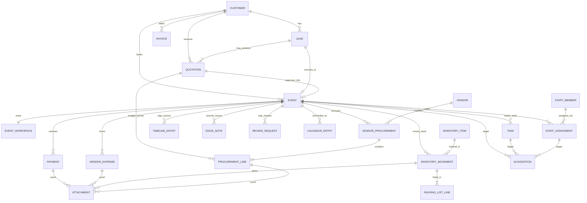

# Event OS Data Model

## Document Metadata

| Field | Value |
|-------|-------|
| **Document Owner** | Founding Engineering |
| **Primary Reviewer** | Ilyas + Zakir (We Decor Events) |
| **Status** | Draft — founder + engineering review |
| **Version** | 1.1 |
| **Created Date** | 2026-07-08 |
| **Last Updated** | 2026-07-08 |
| **Next Review Date** | Not Defined |
| **Document Purpose** | Translate the approved **domain model** (`07-domain-model.md`) into a **logical persistence model** for Phase 1. Defines entities, relationships, ownership, and persistence boundaries that will guide database implementation. This is **not** the SQL schema. |

---

## Version History

| Version | Date | Author | Summary of Changes |
|---------|------|--------|-------------------|
| 1.0 | 2026-07-08 | Founding Engineering | Initial Phase 1 data model derived from `07-domain-model.md`, Doc `19`, ADR-016, ADR-017 |
| 1.1 | 2026-07-08 | Founding Engineering | Updated migration/ORM tooling references to Prisma Migrate + Prisma ORM (technology stack alignment only; no persistence behaviour changes). |

---

## Purpose

This document describes **how Phase 1 aggregates will persist** in a relational store (PostgreSQL per `07-database-philosophy.md`), without committing to specific table names or SQL.

It is the bridge between:

- **Domain model** — aggregates, invariants, workflows (`07-domain-model.md`)
- **Database philosophy** — persistence strategy and multi-tenancy (`07-database-philosophy.md`, ADR-016)
- **Future physical schema** — concrete tables and migrations (to be defined later)

---

## Scope

### In scope

- Logical persistence for all **Phase 1 aggregates and entities** defined in `07-domain-model.md`
- Tenant strategy (single seeded We Decor tenant — ADR-016)
- Ownership, cascade, and delete/update rules between aggregates
- Logical foreign-key and indexing strategy (conceptual, not SQL)
- Mapping from the unified **Event** model to persistence structures
- Persistence of Suggestion records in accordance with ADR-017

### Out of scope

- SQL DDL (`CREATE TABLE`, indexes, constraints)
- Migrations (Prisma Migrate or equivalent migration tooling)
- ORM mappings (Prisma ORM entity mappings and configuration)
- API DTOs and controllers
- UI and application code

No new business capabilities or Phase 1 scope extensions are introduced.

---

## References

| Document | Role |
|----------|------|
| [`docs/business/19-event-os-phase1-requirements.md`](../docs/business/19-event-os-phase1-requirements.md) | **Frozen Phase 1 business baseline** — EP1 IDs, W1–W5 |
| [`05-system-architecture.md`](./05-system-architecture.md) | Architecture, tenancy, automation policy |
| [`06-module-design.md`](./06-module-design.md) | Module responsibility and Phase 1 coverage |
| [`07-domain-model.md`](./07-domain-model.md) | **Authoritative domain aggregates, entities, relationships** |
| [`07-database-philosophy.md`](./07-database-philosophy.md) | Database and multi-tenancy philosophy |
| [`11-roadmap.md`](./11-roadmap.md) | Phase 1 delivery scope and transitional integrations |
| [`12-architecture-decisions.md`](./12-architecture-decisions.md) | **ADR-004**, **ADR-011**, **ADR-012**, **ADR-016**, **ADR-017** |
| [`20-definition-of-done.md`](./20-definition-of-done.md) | Phase 1 completion criteria (org-scoped data, tests) |

---

## Persistence Philosophy

This document assumes the guiding principles in `07-database-philosophy.md`:

- **PostgreSQL as system of record** — all business data lives in a relational store
- **Domain drives schema** — tables follow aggregates from `07-domain-model.md`, not UI
- **Normalize first** — start from a normalized logical model; denormalize only with evidence
- **Migrations are immutable** — this document is the design input, not the migration log

Additional Phase 1-specific principles:

- **One We Decor tenant** (ADR-016) — but schema should be tenant-ready
- **Aggregate boundaries drive persistence** — one primary table per aggregate root, plus owned child tables where needed
- **Cross-context reads via joins or read models** — never by duplicating mutable state
- **No event sourcing** — Phase 1 uses traditional persistence with domain events on top (ADR-012)

---

## Tenant Strategy (ADR-016)

Phase 1 operates in **single-tenant mode** for We Decor (ADR-016). Persistence still prepares for future SaaS:

| Aspect | Logical rule |
|--------|-------------|
| Tenant identity | All tenant-scoped entities carry a `tenant_id` attribute |
| Seed | One **We Decor** tenant row per environment (seeded) |
| Lookup | Application injects tenant context; `tenant_id` is never accepted from API payloads |
| RLS | Row-Level Security is **conceptual only** here; physical RLS rules are defined when SaaS ships |
| Tests | Phase 1 tests enforce correct scoping to We Decor tenant; cross-tenant isolation tests are deferred |

**Tenant-scoped entities** include every aggregate in `07-domain-model.md` (Customer, Lead, Event, etc.). Independent admin/system tables (e.g. `migrations`) are out of scope here.

---

## Aggregate Persistence Rules

General rules for mapping aggregates to persistence:

1. **One primary table per aggregate root**
   - Example: Event → conceptual `events` table; Customer → `customers`.
2. **Owned entities as child tables where needed**
   - Example: ProcurementLine under VendorProcurement; InventoryMovement under Inventory context.
3. **Referenced entities store foreign keys to other roots**
   - Example: Event stores `customer_id`, `quotation_id`, `lead_id`.
4. **No cross-root table ownership**
   - A stored row is owned by exactly one aggregate root’s persistence boundary.
5. **Read models are separate**
   - Reporting views (e.g. Event profitability, founder KPI snapshots) are **derived** and not mutated directly.

The following tables use “conceptual” names — specific names are decided in the schema document.

---

## Entity Ownership & Relationship Strategy

We distinguish:

- **Independent aggregate (AR)** — its own lifecycle, primary table, and ID
- **Owned entity (OE)** — lifecycle controlled by parent aggregate, persisted in child table or embedded structure
- **Referenced entity (REF)** — foreign key link to another aggregate’s primary key

### High-level ownership

| Aggregate root (AR) | Owned entities (OE) | References (REF) |
|---------------------|---------------------|------------------|
| Customer | Contact | Event, Lead, Quotation, Invoice, TimelineEntry, IssueNote, ReviewRequest |
| Lead | FollowUp, LeadStageHistory | Customer, StaffMember, Event, Quotation |
| Quotation | QuotationLineItem | Customer, Lead, Event |
| Event | EventWorkspace, ExecutionProgress | Customer, Lead, Quotation, StaffMember (execution owner) |
| StaffMember | — | StaffAssignment |
| StaffAssignment *(modeled as OE/child)* | — | Event, StaffMember |
| Vendor | VendorIssueNote | VendorProcurement |
| VendorProcurement | ProcurementLine, ProcurementLineIssueNote | Event, Vendor, QuotationLineItem, VendorExpense |
| InventoryItem | LocationQuantity | InventoryMovement, PackingListLine |
| InventoryMovement | PackingList, PackingListLine, DamageNote | Event, InventoryItem, Attachment |
| Task | ChecklistItem | Event, StaffMember, Suggestion target |
| Payment | — | Event, Invoice, Attachment |
| VendorExpense | — | Event, ProcurementLine, Vendor, Attachment |
| Invoice | InvoiceLineItem | Event, Customer, Payment |
| TimelineEntry | — | Event, Customer, StaffMember |
| IssueNote | — | Event, Customer |
| ReviewRequest | — | Event, Customer |
| Attachment | — | Polymorphic parent (Payment, Movement, Expense, ProcurementLine, Event gallery) |
| Suggestion | — | Target aggregate (Event, Task, StaffAssignment, etc.) |
| CalendarEntry | — | Event, Lead, StaffMember |
| FounderKpiSnapshot | — | Derived from Event, Payment, VendorExpense, Lead |

Logical ER diagrams below show relationships only.

---

## Primary Identifier Strategy (ADR-011)

Phase 1 reuses ADR-011:

- **Primary identifiers** — UUID v4 for all aggregate roots and owned entities
- **Display identifiers** (e.g. booking number, invoice number) — tenant-scoped sequence fields, not primary keys

Implications:

- Logical model always has `id` and `tenant_id` as the compound identity for entity membership.
- Human-facing identifiers are read-only from domain perspective and may be regenerated for display purposes.

---

## Foreign Key Strategy

Logical rules for foreign-key relationships:

1. **Tenant consistency** — any foreign key between tenant-scoped entities **must share the same `tenant_id`**.
2. **Point to roots** — FKs always point to aggregate roots, not owned entities, except where owned entities are modeled in separate tables and share the parent key.
3. **Nullability expresses optionality** — e.g. `lead_id` on Event is optional when not derived from a Lead.
4. **Polymorphic references are explicit** — e.g. Attachment references parent via (`parent_type`, `parent_id`), not by multiple nullable FKs.

---

## Soft Delete Strategy

Phase 1 does **not** require global hard deletes for business aggregates. Strategy:

- **Core aggregates** (Customer, Lead, Event, Vendor, StaffMember, InventoryItem): prefer **soft delete** via `status` fields (e.g. `inactive`, `cancelled`, `retired`) and/or `deleted_at` timestamp.
- **Operational records** (Payments, VendorExpenses, InventoryMovements, ProcurementLines): use **void/Cancelled statuses**, not physical delete, except for clear mis-entry during limited correction windows.
- **Attachments**: logical delete via `deleted_at` + storage deletion policy.

The logical model therefore includes:

- `status` fields (see Status Field Standards)
- Optional `deleted_at` audit timestamps where business demands recoverability

---

## Audit Fields & Timestamp Standards

Standard audit attributes:

| Field | Purpose |
|-------|---------|
| `created_at` | When the row was first persisted |
| `updated_at` | When it was last mutated |
| `created_by` | (Optional) Staff/user id; not required for all entities in Phase 1 |
| `updated_by` | (Optional) Last editor id |

**Timestamp standards:**

- All timestamps stored consistently as **UTC**.
- Date-only fields (e.g. event date) use date semantics; date ranges use `start_date`, `end_date` pair.
- For movement and procurement timelines, specific milestone timestamps are stored as dedicated columns (e.g. `requested_at`, `confirmed_at`, `picked_at`).

---

## Status Field Standards

Status fields capture lifecycle as enums. They mirror domain model states but may be stored as:

- **Enum strings** (logical name)
- Or integer enums with mapping in the application layer

Key statuses (non-exhaustive):

- Lead: `new`, `in_talks`, `approved`, `completed`, `lost`, `cancelled`
- Quotation: `draft`, `sent`, `approved`, `rejected`, `expired`, `superseded`
- Event: `approved`, `in_preparation`, `in_execution`, `completed`, `cancelled`
- ProcurementLine: `planned`, `requested`, `confirmed`, `delivered`, `completed`
- InventoryMovement: `planned`, `picked`, `packed`, `loaded`, `at_venue`, `returned`, `cleaned_ready`
- Task: `pending`, `in_progress`, `completed`, `cancelled`
- StaffAssignment: `proposed`, `confirmed`, `released`, `cancelled`
- Payment: `recorded`, `void`
- VendorExpense: `recorded`, `void`
- Invoice: `draft`, `sent`, `partially_paid`, `paid`, `void`
- Suggestion: `pending`, `accepted`, `dismissed`, `expired`

No additional lifecycle states are introduced beyond those in `07-domain-model.md`.

---

## Attachment Strategy

Attachments represent metadata for files stored in object storage. Logical model:

- **Attachment (AR)** — `id`, `tenant_id`, `filename`, `mime_type`, `size`, `storage_key`, `created_at`, `deleted_at`
- **Parent reference** — `(parent_type, parent_id)` — e.g. `Payment`, `InventoryMovement`, `VendorExpense`, `ProcurementLine`, `Event` (for content library)

Cascade rules (logical):

- When a parent is voided or cancelled, attachments remain but may be hidden in UI.
- When a parent is hard-deleted (rare), attachments are soft-deleted and scheduled for blob deletion.

---

## Notes & Timeline Storage

Customer and vendor notes are high-volume append-only records:

- **TimelineEntry** (per event) — separate table, FK to Event and Customer
- **IssueNote** (customer issues) — separate table, FK to Event and Customer
- **VendorIssueNote** (vendor general notes) — table under Vendor
- **ProcurementLineIssueNote** — table under ProcurementLine

Design:

- All notes are **append-only**; editing is modeled as new entries with a pointer to the previous note when necessary.
- Search/filtering is full-text across note body, scoped by `tenant_id` and `event_id` or `vendor_id`.

---

## Money & Currency Handling

Logical representation follows `07-domain-model.md`:

- Monetary fields use a consistent **Money** representation: amount + currency.
- Currency is fixed to We Decor’s currency in Phase 1 (single-tenant, single-currency) but stored explicitly for future SaaS.
- All calculations (totals, balances, profitability) happen server-side in the application; persistence holds raw amounts.

Key money fields:

- Quotation: line item totals, subtotal, discount, tax, total
- Invoice: line item totals, subtotal, tax, total, amount_paid, amount_due
- Payment: amount
- VendorExpense: amount
- Profitability views: derived

---

## Inventory Quantity Rules

Logical invariants (from `08-inventory-workflow.md` and Doc `19`):

- `InventoryItem` holds **master quantity** per location; Phase 1 focuses on JP Nagar.
- `InventoryMovement` and `LocationQuantity` together ensure:
  - No negative quantity at JP Nagar.
  - Movement states that affect availability are well-defined (pickup and return stages).
- Movement confirmations are always **human-driven** and respect movement permissions (EP1-STF-003).

Persistence implications:

- A movement’s state transitions should be idempotent and auditable (timestamp per state).
- Queries for “available quantity” aggregate LocationQuantity minus active movements in non-returned states.

---

## Procurement Persistence

Vendor procurement is modeled as:

- **VendorProcurement (AR)** — header with `event_id`, `vendor_id`, summary info.
- **ProcurementLine (OE)** — child rows for each material/service.

Each `ProcurementLine` stores:

- `event_id`, `vendor_procurement_id`, optional `quotation_line_item_id`
- Budgeted amount (from quotation)
- Actual amount (what is expected/paid)
- State (`planned`, `requested`, `confirmed`, `delivered`, `completed`)
- Timestamps: `requested_at`, `confirmed_at`, `delivered_at`, `completed_at`
- Optional `cost_variance_reason` and `cost_variance_amount`

`VendorExpense` links back to `ProcurementLine` via FK to support per-line payment tracking and profitability.

---

## Payment Persistence

Customer payments:

- **Payment (AR)** — includes `event_id`, optional `invoice_id`, `amount`, `method`, `received_at`, optional `attachment_id` (proof), and free-text `missing_proof_reason`.
- Advance vs balance may be expressed via a `payment_type` field (`advance`, `balance`, `other`) or by invoice structure; logically flagged for reporting.

Vendor expenses:

- **VendorExpense (AR)** — `event_id`, `vendor_id`, optional `procurement_line_id`, `amount`, `paid_at`, `method`, `attachment_id`.

Logical rules:

- Lead stage transition to **Approved** is blocked until a qualifying `Payment` exists (EP1-BR-001).
- Event transition to **Completed** is blocked until finance review over Payment + VendorExpense passes EP1-BR-002.

---

## Suggestion Persistence (ADR-017)

Suggestions are central to Phase 1 recommendation-only automation:

- **Suggestion (AR)** — `id`, `tenant_id`, `type`, `status`, `aggregate_type`, `aggregate_id`, `payload` (JSON), `source_event_id`, `created_at`, `resolved_at`, `resolved_by`.
- Suggestion table is multi-purpose across modules; types include (examples only, not new capabilities): `workspace.create`, `checklist.generate`, `staff.assign`, `calendar.milestone`.

Logical constraints:

- `status` can only be changed by explicit user action (accept/dismiss) or by expiry logic in application code.
- Accepting a Suggestion triggers the corresponding application service use case; the Suggestion row itself remains for audit.

No handler writes directly to business tables; they **only write Suggestions and Alerts** (per ADR-017).

---

## Concurrency & Locking Strategy

Logical guidance:

- Use **optimistic concurrency** at the aggregate level (e.g. `version` field or `updated_at` check) rather than explicit locks.
- Event-level operations that aggregate multiple child entities (e.g. profitability recompute) happen within transactions that read current snapshots.
- InventoryMovement and ProcurementLine updates must guard against conflicting updates:
  - Updates check current `state` and `tenant_id` before applying transition.
  - Avoid long-lived distributed locks; conflicts resolved via retry on optimistic concurrency failure.

---

## Transaction Boundaries

Transaction boundaries mirror domain-level use cases:

- **Lead → Event conversion** — create Event (+ workspace activation Suggestion), link to Customer and Quotation in one transaction.
- **Packing list generation** — create PackingList and lines in one transaction, but only as a result of an accepted Suggestion.
- **Procurement line state transitions** — single ProcurementLine plus related VendorExpense creation in one transaction where applicable.
- **Movement state transitions** — single InventoryMovement per transaction; aggregate-level quantity checks performed inside.
- **Payment / VendorExpense recording** — each is atomic; triggers derived view updates.

Domain events (ADR-012) fire **after commit** and feed Suggestion creation outside of the transaction.

---

## Search & Filtering Strategy

Logical search behaviors:

- **Event lists** — filter by date ranges, preparation status, execution owner, and risk signals (e.g. cost variance flags).
- **Lead lists** — filter by source, stage, assigned staff, and date ranges.
- **Procurement lists** — filter by vendor, event, state.
- **Inventory views** — filter by category, location, availability.
- **Timeline and issues** — filter by event, customer, type, and date.

Search always scopes by tenant and may use full-text search on text fields (notes, titles) as needed.

Indexing recommendations below support typical filter patterns; physical index definitions are determined later.

---

## Indexing Recommendations

Logical index suggestions (following `tenant_id`-first rule from `07-database-philosophy.md`):

- Event: (`tenant_id`, `status`, `event_start_date`), (`tenant_id`, `execution_owner_id`)
- Lead: (`tenant_id`, `stage`), (`tenant_id`, `assigned_to`), (`tenant_id`, `source`)
- VendorProcurement: (`tenant_id`, `event_id`), (`tenant_id`, `vendor_id`)
- ProcurementLine: (`tenant_id`, `event_id`, `state`)
- InventoryMovement: (`tenant_id`, `event_id`, `state`), (`tenant_id`, `inventory_item_id`, `state`)
- Payment: (`tenant_id`, `event_id`), (`tenant_id`, `invoice_id`)
- VendorExpense: (`tenant_id`, `event_id`), (`tenant_id`, `vendor_id`)
- Suggestion: (`tenant_id`, `status`, `type`), (`tenant_id`, `aggregate_type`, `aggregate_id`)
- TimelineEntry / IssueNote: (`tenant_id`, `event_id`, `created_at`)

Text search indexes for notes may be added later based on volume and performance needs.

---

## Reporting Considerations

Reporting should use **read models** or materialized views where needed:

- Event profitability — derived from Payment + VendorExpense grouped by Event.
- Founder KPIs — derived from Event, Lead, Payment, VendorExpense per EP1-KPI-001–007.
- Lead funnels — derived from Lead stage history and LeadSource.

Reporting artifacts do **not** become first-class aggregates; they are projections of core domain tables.

---

## Existing System Migration Mapping

Transition from current systems (`11-roadmap.md` Transitional Integrations):

| Legacy system | Source artifacts | Target aggregates | Strategy |
|---------------|------------------|-------------------|----------|
| Lead Management Application | Leads, statuses, assignments, review flag | Lead, Customer, ReviewRequest | Export + import to Event OS Lead/Customer; maintain IDs only for historical reference |
| Quotation/Billing Application | Quotations, PDF paths, invoice records | Quotation, Invoice | Migrate selected historical data; new records created only in Event OS post-cutover |
| We Decor Website | Contact form submissions | Lead, Customer | New leads directly persisted to Lead; no migration of transient contact submissions |
| WhatsApp (external) | Chat history | TimelineEntry (manual summary only) | No bulk import; future entries captured manually as notes |

Migration specifics (scripts, one-off tools) are out of scope here; this section only ensures there is a **home** in the logical model for migrated data.

---

## Traceability to Domain Aggregates

Mapping from `07-domain-model.md` aggregates to their logical persistence owners:

| Domain aggregate | Persistence owner | Notes |
|------------------|-------------------|-------|
| Customer | Customer AR table | Contacts child table |
| Lead | Lead AR table | FollowUp, LeadStageHistory child tables |
| Quotation | Quotation AR table | QuotationLineItem child table |
| Event | Event AR table | EventWorkspace, ExecutionProgress child tables |
| EventWorkspace | Owned by Event | No separate root table required; may share `events` table or use adjunct table |
| StaffAssignment | Event/Staff child table | Links StaffMember and Event |
| StaffMember | StaffMember AR table | Links to auth user outside this doc |
| Vendor | Vendor AR table | VendorIssueNote child table |
| VendorProcurement | VendorProcurement AR table | ProcurementLine, ProcurementLineIssueNote child tables |
| InventoryItem | InventoryItem AR table | LocationQuantity child table(s) |
| InventoryMovement | InventoryMovement AR table | PackingList, PackingListLine, DamageNote child tables |
| Task | Task AR table | ChecklistItem child table |
| TimelineEntry | TimelineEntry table | Event/Customer-linked |
| IssueNote | IssueNote table | Event/Customer-linked |
| ReviewRequest | ReviewRequest table | Event/Customer-linked |
| Payment | Payment AR table | Attachment via FK |
| VendorExpense | VendorExpense AR table | Attachment via FK |
| Invoice | Invoice AR table | InvoiceLineItem child table |
| Attachment | Attachment AR table | Polymorphic parent ref |
| Suggestion | Suggestion AR table | Target aggregate type/id columns |
| CalendarEntry | CalendarEntry AR table | Links to Event/Lead |
| FounderKpiSnapshot | Read model table | Derived only |

---

## Traceability to EP1 Requirement IDs

Persistence responsibilities per EP1 from Doc `19`:

| EP1 ID | Logical persistence focus |
|--------|---------------------------|
| EP1-SAL-001–006 | Lead, FollowUp, LeadStageHistory, StaffAssignment (sales), Notification/Suggestion linkages |
| EP1-CUS-001–004 | Customer, TimelineEntry, IssueNote, ReviewRequest tables |
| EP1-FIN-001–005 | Quotation, Invoice, Payment, VendorExpense, EventProfitabilityView |
| EP1-OPS-001–005 | Event, EventWorkspace, ExecutionProgress, Task, CalendarEntry |
| EP1-STF-001–003 | StaffMember, StaffAssignment, permission tables (movement permissions) |
| EP1-VEN-001–006 | Vendor, VendorProcurement, ProcurementLine, VendorIssueNote, ProcurementLineIssueNote, VendorExpense |
| EP1-INV-001–007 | InventoryItem, LocationQuantity, InventoryMovement, PackingList, DamageNote, Attachment |
| EP1-MKT-001–004 | LeadSource fields, FounderKpiSnapshot, Attachment (content library) |
| EP1-AUT-001–006 | Suggestion, BusinessRuleEnforcement context, EventWorkspace linkage |
| EP1-KPI-001–007 | FounderKpiSnapshot + supporting aggregates |
| EP1-BR-001–004 | Fields and relations necessary for rule enforcement (Payment, Event, Lead, ExecutionProgress) |

No new EP1 IDs or capabilities are introduced.

---

## Deferred Persistence Concerns

Out of Phase 1 scope (for clarity, not design here):

| Concern | Deferred to | Notes |
|---------|-------------|-------|
| Multi-tenant onboarding, billing tables | Phase 6 / Doc `20` | Existing `tenant_id` fields prepare schema |
| AI conversation logs & prompts | Phase 5 | Separate `ai_conversations` and `ai_suggestions` tables later |
| WhatsApp message logs | Phase 5 | External integration tables |
| CMS pages, SEO metadata | Phase 4 | Separate CMS context tables |
| Full complaint ticketing tables | Post Phase 1 | IssueNote only now |
| Extended accounting (ledger, journals) | Phase 3+ | VendorExpense + Invoice are sufficient for Phase 1 P&L |
| Multi-warehouse inventory locations | Future | Phase 1 single JP Nagar location only |

---

## Mermaid ER Diagram (Logical Relationships)

---

*Last updated: 2026-07-08*  
*Owner: Founding Engineering*  
*Version: 1.0 — Draft for review*

