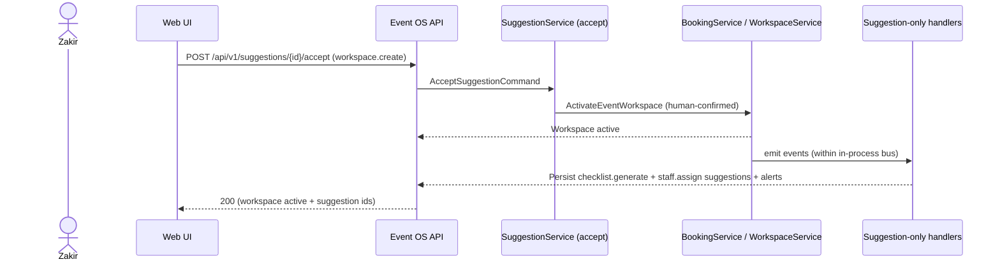
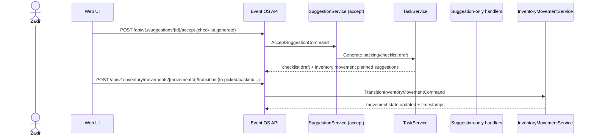
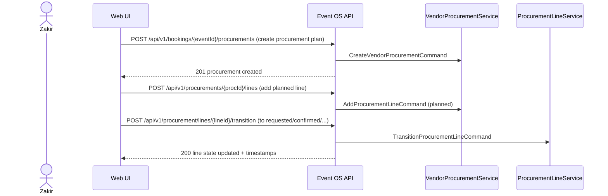

# Event OS API Design

## Document Metadata

| Field | Value |
|-------|-------|
| **Document Owner** | Founding Engineering |
| **Primary Reviewer** | Ilyas + Zakir (We Decor Events) |
| **Status** | Draft — engineering approval |
| **Version** | 1.1 |
| **Created Date** | 2026-07-08 |
| **Last Updated** | 2026-07-08 |
| **Next Review Date** | Not Defined |
| **Document Purpose** | Define the application service layer and REST API contract between UI and the approved domain model. Blueprint for NestJS controllers and application services. No code/DTOs/OpenAPI/SQL. |

---

## Version History

| Version | Date | Author | Summary of Changes |
|---------|------|---------|---------------------|
| 1.0 | 2026-07-08 | Founding Engineering | Phase 1 API contract (W1–W5) from `07-domain-model`, `08-data-model`, ADR-016/017 |
| 1.1 | 2026-07-08 | Founding Engineering | Migrated technology wording from Spring Boot controllers/services to NestJS controllers and application services (no API or behaviour change). |

---

## Purpose

This document translates the approved domain model and logical persistence model into an implementation-ready REST API contract.

Primary inputs:

- Phase 1 business baseline: `docs/business/19-event-os-phase1-requirements.md`
- Authoritative domain model: `docs/07-domain-model.md`
- Authoritative logical persistence: `docs/08-data-model.md`
- Tenancy + module boundaries: `docs/05-system-architecture.md`, `docs/06-module-design.md`
- REST conventions: `docs/18-api-standards.md`
- Constraints:
  - Single-tenant Phase 1 mode: ADR-016
  - Suggestion-only domain event handlers in Phase 1: ADR-017

---

## Scope

### In scope (Phase 1 only)

REST API design grouped by module:

1. Lead Management
2. Customer
3. Quotation
4. Booking
5. Event Workspace
6. Task Management
7. Staff Management
8. Vendor Procurement
9. Inventory
10. Payments
11. Finance
12. Dashboard
13. Administration

All endpoints are limited to the approved Phase 1 capabilities and must-pass workflows W1–W5.

### Out of scope

- No SQL schema / DDL / migrations
- No API DTO classes / OpenAPI YAML
- No multi-tenant SaaS lifecycle (Doc `20`)
- No AI assistant core and no full WhatsApp replacement
- No new business workflows or operational stages beyond Doc `19`

---

## References

| Document | Role |
|----------|------|
| `docs/business/19-event-os-phase1-requirements.md` | Frozen Phase 1 scope, EP1 IDs, W1–W5 |
| `docs/07-domain-model.md` | Aggregates, entities, invariants, lifecycles |
| `docs/08-data-model.md` | Persistence model rules, identifier + concurrency guidance |
| `docs/05-system-architecture.md` | Tenancy + RBAC roles, authorization boundaries |
| `docs/06-module-design.md` | Module responsibilities and Phase 1 coverage |
| `docs/18-api-standards.md` | REST URL conventions, response envelope, errors, pagination/filtering/sorting |
| `docs/12-architecture-decisions.md` | ADR-016 and ADR-017 |
| `docs/14-security-principles.md` | RBAC + permissions expectations, validation at API boundary |

---

## API Design Principles

All endpoints follow `docs/18-api-standards.md`:

- Versioned base path: `/api/v1/...`
- All success responses wrap payload in `{ "data": ... }`
- All request/response bodies are JSON, except file upload uses `multipart/form-data`
- Money objects always `{ amount, currency }`
- Dates are ISO 8601
- Tenant context is always derived from auth context (ADR-016); `tenantId` is never in request payload/query

Phase 1 business constraints:

- Domain-event handlers in Phase 1 produce **suggestions/alerts only** (ADR-017)
- Any business action requires explicit human confirmation (EP1-AUT-005); human confirmation may be either:
  - user directly invoking a command endpoint, or
  - accepting a pending suggestion via `POST /api/v1/suggestions/:id/accept`
- Hard blocks enforced in application layer before mutation:
  - EP1-BR-001 (advance before Approved)
  - EP1-BR-002 (financial review before Completed)
  - EP1-BR-003 (execution ownership before execution stages)

---

## Authentication & Authorization Assumptions

Authentication:

- `Authorization: Bearer <access_token>`

Authorization:

- RBAC roles from `docs/05-system-architecture.md`:
  - `owner`, `admin`
  - `sales_manager`, `sales`
  - `operations_manager`, `coordinator`
  - `finance`
  - `marketing` (Phase 1 limited)
  - `viewer` (read-only)

Permissions:

- This doc specifies expected permission keys per endpoint using the convention `<resource>:<action>` (consistent with `docs/14-security-principles.md` examples like `leads:read`, `leads:assign`, `quotations:approve`).
- Permission checks must happen in the application service layer (per security principles).

---

## Tenant Context Handling (ADR-016)

- Phase 1 is single We Decor tenant (ADR-016).
- API resolves `OrgContext.tenantId` from authenticated user.
- All resources are tenant-scoped at the application layer and persistence layer (per `docs/08-data-model.md` and `docs/14-security-principles.md`).
- Cross-tenant missing resources return `404` (not `403`) to prevent information leakage (per API standards).

---

## Error Handling Standards

Use HTTP statuses and error envelope from `docs/18-api-standards.md`.

Recommended Phase 1 additional error codes:

- `CONCURRENT_MODIFICATION` (409): optimistic concurrency failure (`If-Match` mismatch)
- `SUGGESTION_NOT_ACTIONABLE` (409): suggestion not in `pending`
- `SUGGESTION_TARGET_MISMATCH` (409): suggestion does not map to the attempted action

---

## Validation Standards

Request validation:

- Validate request bodies with schemas at API boundary (see `docs/14-security-principles.md`)
- Money: `{ amount: number, currency: string }` with `amount >= 0`
- Dates: `YYYY-MM-DD` for date, RFC3339 for datetime (`...Z`)
- Optional fields:
  - omitted on create
  - `null` clears on update

Business validation:

- Domain invariants from `docs/07-domain-model.md`
- Hard blocks from `docs/business/14-business-rules.md`
- Optimistic concurrency checks for updates (see below)

---

## Pagination / Search / Sorting / Filtering Standards

From `docs/18-api-standards.md`:

- Pagination: offset with `page` + `pageSize` (default `page=1`, `pageSize=20`, max `100`)
- Search: `?search=...` (full-text, tenant-scoped)
- Sorting: `?sortBy=field&sortOrder=asc|desc`
- Filtering: query params as filters, comma-separated multi-values, date ranges with `createdAfter/createdBefore`

---

## File Upload Strategy

Used for attachments linked to payments, inventory movement photos, vendor/expense proofs, and event content library.

Upload:

- `POST /api/v1/files/upload` with `multipart/form-data`
- Server validates MIME + size (default 10MB unless overridden by tenant config)
- Response returns attachment reference `attachmentId` (Attachment AR id)

Linking:

- State-changing endpoints accept `attachmentId` (or omit it)
- No file upload implementation inside business module endpoints

---

## Optimistic Concurrency Strategy

Applies to state-changing updates on existing aggregates.

- Aggregates include `version` (per `docs/08-data-model.md`)
- Client sends expected version in `If-Match: "<version>"`
- If mismatch: `409 CONCURRENT_MODIFICATION`

Create endpoints do not require `If-Match`.

---

## Suggestion Workflow (ADR-017)

Phase 1 handler contract:

- Handlers only create **Suggestions** and **in-app alerts**.
- Handlers must not auto-execute business actions.
- Execution happens only when a user accepts a pending suggestion.

Suggestion endpoints (Administration module):

- `GET /api/v1/suggestions?status=pending`
- `POST /api/v1/suggestions/:id/accept`
- `POST /api/v1/suggestions/:id/dismiss`

Suggestion types used in Phase 1 (from ADR-017 + domain model wiring):

- `workspace.create` (EP1-AUT-002)
- `checklist.generate` (EP1-AUT-003)
- `staff.assign` (EP1-AUT-004)

For Phase 1 inventory + vendor procurement workflow, business actions are human commands directly, not additional suggestion types.

---

## Sequence Diagrams (Mermaid)

### W5 Lead → Booking

```mermaid
sequenceDiagram
  actor Zakir as Zakir
  participant UI as Web UI
  participant API as Event OS API
  participant LeadSvc as LeadService
  participant DomainBus as Domain events
  participant SuggestionH as Suggestion-only handlers

  UI->>API: PATCH /api/v1/leads/{leadId}/stage (to approved)
  API->>LeadSvc: UpdateLeadStageCommand
  LeadSvc->>LeadSvc: Validate allowed transition + EP1-BR-001 gate
  LeadSvc->>DomainBus: Emit LeadStageChanged (+ conversion chain)
  DomainBus->>LeadSvc: Create/Link Customer + Quotation + Approved Event
  DomainBus->>SuggestionH: Create workspace.create suggestion (ADR-017)
  SuggestionH-->>API: Persist Suggestion (pending) + in-app alert
  API-->>UI: 200 (lead updated; event reference)
```

### W1 Approved Booking → Event Execution



### W2 Event Preparation → Inventory Movement



### W3 Event → Vendor Procurement



### W4 Customer Payment → Financial Completion

```mermaid
sequenceDiagram
  actor Finance as Finance
  actor Zakir as Zakir
  participant UI as Web UI
  participant API as Event OS API
  participant PaymentSvc as PaymentService
  participant ExpenseSvc as ExpenseService
  participant BookingSvc as BookingService

  Finance->>API: POST /api/v1/payments (record advance/balance + proof)
  API->>PaymentSvc: RecordPaymentCommand
  PaymentSvc-->>API: payment recorded

  Finance->>API: POST /api/v1/bookings/{eventId}/expenses (record vendor expense + proof optional)
  API->>ExpenseSvc: RecordExpenseCommand
  ExpenseSvc-->>API: expense recorded

  Zakir->>API: POST /api/v1/bookings/{eventId}/complete
  API->>BookingSvc: CompleteBookingCommand
  BookingSvc-->>API: EP1-BR-002 enforced; event completed; KPIs refresh triggers
```

---

## Module: Lead Management

### Purpose

- Lead capture (all intake channels)
- Pipeline stage progression (New → In Talks → Approved → Completed)
- Lead assignment
- Structured follow-ups

### Application Services

- `LeadService`
- `FollowUpService`

### Primary aggregates

- `Lead` (aggregate root)
- `FollowUp` (owned entity)

### Related EP1 IDs

- EP1-SAL-001, EP1-SAL-002, EP1-SAL-003, EP1-SAL-004, EP1-SAL-005, EP1-SAL-006
- EP1-AUT-006 (conversion chain linkage)
- EP1-BR-001 (advance before Approved)

---

### REST Endpoints

#### Read

1. `GET /api/v1/leads`
- Required role: `owner`, `admin`, `sales_manager`, `sales`, `operations_manager`, `coordinator`, `finance`, `viewer`
- Expected permission: `leads:read`
- Primary aggregate: `Lead`
- Transaction boundary: read-only
- User approval required: No

2. `GET /api/v1/leads/:id`
- Required role: same as list
- Expected permission: `leads:read`
- Primary aggregate: `Lead`
- Transaction boundary: read-only
- User approval required: No

3. `GET /api/v1/leads/pipeline`
- Required role: `sales_manager`, `owner`, `admin`, `viewer`
- Expected permission: `leads:read`
- Primary aggregate: `Lead`
- Transaction boundary: read-only
- User approval required: No

#### State-changing

4. `POST /api/v1/leads`
- Required role: `sales_manager`, `sales`, `owner`, `admin`
- Expected permissions: `leads:write`
- Primary aggregate: `Lead`
- Transaction boundary: create Lead
- User approval required: No (explicit create by user)

Request model (body):
```json
{
  "source": "instagram|website|whatsapp|referral|walk_in|phone|other",
  "sourceDetail": "string|null",
  "eventType": "string",
  "eventDate": { "start": "YYYY-MM-DD", "end": "YYYY-MM-DD" },
  "venue": "string|null",
  "estimatedBudget": { "amount": 0, "currency": "INR" },
  "guestCount": 0,
  "notes": "string|null"
}
```

Command: `CreateLeadCommand`
Validation: matches EP1-SAL-002 taxonomy; date range valid; money amount non-negative.
Domain service: `LeadService.create()`
Domain event: `LeadCreated`
Suggestion: none
Response:
```json
{ "data": { "id": "uuid", "stage": "new", "assignedTo": null, "createdAt": "..." } }
```

5. `PATCH /api/v1/leads/:id/stage`
- Required role: `sales_manager`, `owner`, `admin`
- Expected permissions: `leads:stage:update`
- Primary aggregate: `Lead`
- Transaction boundary: Lead stage change + stage history (and conversion chain linkages if stage=approved)
- User approval required: Yes (explicit human command)

If-Match required for updates: yes.

Request model:
```json
{ "stage": "in_talks|approved|completed|lost|cancelled", "version": 1 }
```

Command: `UpdateLeadStageCommand`
Validation:
- allowed transition per `docs/07-domain-model.md`
- EP1-BR-001: if stage=approved, require advance payment exists for resulting Approved chain
- If-Match version check (optimistic concurrency)
Domain service: `LeadService.updateStage()`
Domain event: `LeadStageChanged` (and conversion chain linkage events)
Suggestion (ADR-017): `workspace.create` may be created after conversion to Approved event
Response:
```json
{ "data": { "leadId": "uuid", "stage": "approved", "eventId": "uuid|null" } }
```

6. `POST /api/v1/leads/:id/assign`
- Required role: `sales_manager`, `owner`, `admin`
- Expected permissions: `leads:assign`
- Primary aggregate: `Lead`
- Transaction boundary: update assigned staff + notification audit
- User approval required: Yes

Request model:
```json
{ "staffId": "uuid" }
```

Command: `AssignLeadCommand`
Validation: staff active; within tenant; lead stage assignable.
Domain service: `LeadService.assign()`
Domain event: `LeadAssigned`
Suggestion: none (assignment is human explicit)
Response:
```json
{ "data": { "id": "uuid", "assignedTo": "uuid" } }
```

7. `POST /api/v1/leads/:id/follow-ups`
- Required role: `sales_manager`, `sales`, `owner`, `admin`
- Expected permissions: `leads:followups:write`
- Primary aggregate: `FollowUp`
- Transaction boundary: create FollowUp for Lead
- User approval required: Yes (human sets reminder via command)

Request model:
```json
{
  "dueAt": "YYYY-MM-DDTHH:mm:ssZ",
  "notes": "string|null"
}
```

Command: `CreateFollowUpCommand`
Validation: dueAt is future/valid (implementation policy); lead exists.
Domain service: `FollowUpService.create()`
Domain event: `FollowUpCreated` (optional)
Suggestion: none
Response:
```json
{ "data": { "id": "uuid", "leadId": "uuid", "dueAt": "..." } }
```

8. `PATCH /api/v1/follow-ups/:id`
- Required role: `sales_manager`, `sales`, `owner`, `admin`
- Expected permissions: `leads:followups:write`
- Primary aggregate: `FollowUp`
- Transaction boundary: update FollowUp (status/due date)
- User approval required: Yes

If-Match for updates: yes.

Request model:
```json
{
  "status": "pending|done|cancelled",
  "dueAt": "YYYY-MM-DDTHH:mm:ssZ|null",
  "comment": "string|null",
  "version": 1
}
```

Command: `UpdateFollowUpCommand`
Validation: follow-up belongs to tenant; allowed transitions.
Domain service: `FollowUpService.update()`
Domain event: `FollowUpUpdated` (optional)
Suggestion: none
Response:
```json
{ "data": { "id": "uuid", "status": "done" } }
```

---

## Module: Customer

### Purpose

- Customer profile management
- Communication timeline (per event)
- Lightweight issue notes (per event)
- Review request tracking (per event)

### Application Services

- `CustomerService`
- `TimelineService`
- `IssueService`
- `ReviewRequestService`

### Primary aggregates

- `Customer` (CRM client)
- `TimelineEntry`
- `IssueNote`
- `ReviewRequest`

### Related EP1 IDs

- EP1-CUS-001, EP1-CUS-002, EP1-CUS-003, EP1-CUS-004
- EP1-SUP-001–003 (aliases)

---

### REST Endpoints

Reads:

1. `GET /api/v1/clients` (list)
- Required role: `viewer`, `owner`, `admin`, module roles
- Expected permissions: `clients:read`
- Primary aggregate: `Customer`
- Transaction boundary: read-only
- User approval required: No

2. `GET /api/v1/clients/:id`
- Required role: same as list
- Expected permissions: `clients:read`
- Primary aggregate: `Customer`
- Transaction boundary: read-only
- User approval required: No

Timeline:

3. `GET /api/v1/clients/:id/interactions`
- Required role: `viewer`, `owner`, `admin`, operations_manager, coordinator, sales_manager
- Expected permissions: `timeline:read`
- Primary aggregate: `TimelineEntry`
- Transaction boundary: read-only
- User approval required: No

State-changing:

4. `POST /api/v1/clients`
- Required role: `sales_manager`, `operations_manager`, `owner`, `admin`
- Expected permissions: `clients:write`
- Primary aggregate: `Customer`
- Transaction boundary: create Customer (+ initial contact if provided)
- User approval required: Yes (human command)

Command: `CreateCustomerCommand`
Validation: tenant scoped; contact reachability if provided.
Domain service: `CustomerService.create()`
Domain event: `ClientCreated`
Suggestion: none
Response:
```json
{ "data": { "id": "uuid", "name": "string", "status": "active" } }
```

Request model:
```json
{ "name": "string", "type": "individual|organization", "notes": "string|null" }
```

5. `PATCH /api/v1/clients/:id`
- Required role: `operations_manager`, `sales_manager`, `owner`, `admin`
- Expected permissions: `clients:write`
- Primary aggregate: `Customer`
- Transaction boundary: update Customer profile
- User approval required: Yes

If-Match for updates: yes.

Command: `UpdateCustomerCommand`
Validation: tenant scoped; uniqueness constraints handled by domain (if applicable).
Domain service: `CustomerService.update()`
Domain event: `ClientUpdated`
Suggestion: none
Response: updated client

Request model:
```json
{ "name": "string|null", "notes": "string|null", "version": 1 }
```

6. `POST /api/v1/clients/:id/contacts`
- Required role: `sales_manager`, `operations_manager`, `owner`, `admin`
- Expected permissions: `clients:write`
- Primary aggregate: `Customer` (owned Contact entities)
- Transaction boundary: add contact to customer
- User approval required: Yes

Command: `AddContactCommand`
Validation: at least one reachable phone/email; normalize phone/email.
Domain service: `CustomerService.addContact()`
Domain event: `ContactAdded`
Suggestion: none
Response:
```json
{ "data": { "id": "uuid", "contactsCount": 2 } }
```

Request model:
```json
{ "name": "string", "role": "string", "phone": { "countryCode": "+91", "number": "9876543210" }, "email": { "value": "x@y.com" } }
```

7. `POST /api/v1/clients/:id/interactions`
- Required role: `operations_manager`, `coordinator`, `sales_manager`, `owner`, `admin`
- Expected permissions: `timeline:write`
- Primary aggregate: `TimelineEntry`
- Transaction boundary: append timeline entry
- User approval required: Yes

Command: `LogTimelineEntryCommand`
Validation: referenced `eventId` belongs to tenant; message non-empty.
Domain service: `TimelineService.log()`
Domain event: `TimelineEntryAdded`
Suggestion: none
Response:
```json
{ "data": { "id": "uuid", "eventId": "uuid", "type": "note" } }
```

Request model:
```json
{ "eventId": "uuid", "type": "note|issue|other", "message": "string", "occurredAt": "YYYY-MM-DDTHH:mm:ssZ" }
```

8. `POST /api/v1/events/:eventId/issues`
- Required role: `operations_manager`, `coordinator`, `owner`, `admin`
- Expected permissions: `issues:write`
- Primary aggregate: `IssueNote`
- Transaction boundary: create issue note linked to Event + Customer
- User approval required: Yes

Command: `CreateIssueNoteCommand`
Validation: event belongs to tenant; message non-empty.
Domain service: `IssueService.create()`
Domain event: `IssueNoteCreated`
Suggestion: none
Response:
```json
{ "data": { "id": "uuid", "eventId": "uuid", "status": "open" } }
```

Request model:
```json
{ "message": "string", "severity": "low|medium|high", "notes": "string|null" }
```

9. `POST /api/v1/events/:eventId/review-requests`
- Required role: `sales_manager`, `operations_manager`, `owner`, `admin`
- Expected permissions: `reviews:write`
- Primary aggregate: `ReviewRequest`
- Transaction boundary: create review request record for Event
- User approval required: Yes

Command: `CreateReviewRequestCommand(eventId, channel)`
Validation: Event belongs to tenant; timing not predefined by business (accept human decision).
Domain service: `ReviewRequestService.create()`
Domain event: `ReviewRequestCreated`
Suggestion: none
Response:
```json
{ "data": { "id": "uuid", "eventId": "uuid", "status": "pending" } }
```

Request model:
```json
{ "channel": "google|instagram|other", "channelDetail": "string|null" }
```

---

## Module: Quotation

### Purpose

- Create and manage quotations (with line items)
- Send quotation (human command)
- Approve/reject/revise quotation (human command)

### Application Services

- `QuotationService`
- `QuotationLineItemService`
- `QuotationPdfService` (logical)

### Primary aggregates

- `Quotation`
- `QuotationLineItem`

### Related EP1 IDs

- EP1-FIN-001
- EP1-AUT-006 (approved chain links to Event)

---

### REST Endpoints

Reads:

1. `GET /api/v1/quotations`
- Role: `owner`, `admin`, `sales_manager`, `sales`, `viewer`
- Permission: `quotations:read`
- Primary aggregate: `Quotation`
- Transaction boundary: read-only
- Approval required: No

2. `GET /api/v1/quotations/:id`
- Role/perm: `quotations:read`
- Primary: `Quotation`

3. `GET /api/v1/quotations/:id/pdf`
- Role: roles allowed for read + send/approve flows (implementation decision)
- Permission: `quotations:read`
- Primary: `Quotation`
- Approval required: No

State-changing:

4. `POST /api/v1/quotations`
- Role: `sales_manager`, `sales`, `owner`, `admin`
- Permission: `quotations:write`
- Primary: `Quotation`
- Transaction boundary: create quotation + header fields
- Approval required: Yes (human command)

Request:
```json
{
  "leadId": "uuid|null",
  "clientId": "uuid",
  "eventType": "string",
  "eventDate": { "start": "YYYY-MM-DD", "end": "YYYY-MM-DD" },
  "venue": "string|null",
  "validUntil": "YYYY-MM-DD",
  "terms": "string",
  "notes": "string|null"
}
```

Command: `CreateQuotationCommand`
Validation: tenant scoped; valid dates; cannot create in non-draft (domain).
Domain service: `QuotationService.create()`
Domain event: `QuotationCreated`
Suggestion: none
Response:
```json
{ "data": { "id": "uuid", "status": "draft", "version": 1 } }
```

5. `PATCH /api/v1/quotations/:id`
- Role: `sales_manager`, `owner`, `admin`
- Permission: `quotations:write`
- Primary: `Quotation`
- Transaction boundary: update editable fields (draft only)
- Approval required: Yes (human command)

If-Match: required.
Command: `UpdateQuotationCommand`
Validation: quotation editable (domain); valid transitions.
Domain service: `QuotationService.update()`
Domain event: `QuotationUpdated` (optional)
Suggestion: none
Response: updated quotation (draft)

Request:
```json
{ "terms": "string|null", "notes": "string|null", "version": 1 }
```

6. `POST /api/v1/quotations/:id/line-items`
- Role: `sales_manager`, `owner`, `admin`
- Permission: `quotations:write`
- Primary: `QuotationLineItem`
- Transaction boundary: add line item to quotation (draft only)
- Approval required: Yes

Command: `AddQuotationLineItemCommand`
Validation: quotation is draft; line item fields valid; Money non-negative.
Domain service: `QuotationLineItemService.add()`
Domain event: `QuotationLineItemAdded`
Suggestion: none
Response:
```json
{ "data": { "id": "uuid", "quotationId": "uuid" } }
```

Request:
```json
{
  "description": "string",
  "packageId": "uuid|null",
  "quantity": 1,
  "unitPrice": { "amount": 10000, "currency": "INR" },
  "sortOrder": 0
}
```

7. `PATCH /api/v1/quotations/:id/line-items/:itemId`
- Role: `sales_manager`, `owner`, `admin`
- Permission: `quotations:write`
- Primary: `QuotationLineItem`
- Transaction boundary: update line item (draft only)
- Approval required: Yes

If-Match: required.
Command: `UpdateQuotationLineItemCommand`
Validation: quotation editable; unit price non-negative.
Domain service: `QuotationLineItemService.update()`
Domain event: `QuotationLineItemUpdated`
Suggestion: none
Response: updated line

Request:
```json
{ "quantity": 2, "unitPrice": { "amount": 12000, "currency": "INR" }, "version": 1 }
```

8. `DELETE /api/v1/quotations/:id/line-items/:itemId`
- Role: `sales_manager`, `owner`, `admin`
- Permission: `quotations:write`
- Primary: `QuotationLineItem`
- Transaction boundary: soft delete line item (draft only)
- Approval required: Yes

Command: `RemoveQuotationLineItemCommand`
Validation: quotation editable as draft
Domain service: `QuotationLineItemService.remove()`
Domain event: `QuotationLineItemRemoved` (optional)
Suggestion: none
Response:
```json
{ "data": { "itemId": "uuid", "deleted": true } }
```

9. `POST /api/v1/quotations/:id/send`
- Role: `sales_manager`, `sales`, `owner`, `admin`
- Permission: `quotations:send`
- Primary: `Quotation`
- Transaction boundary: set sent and store send context
- Approval required: Yes

Command: `SendQuotationCommand`
Validation: quotation can be sent (domain); has at least 1 line.
Domain service: `QuotationService.send()`
Domain event: `QuotationSent`
Suggestion: none
Response:
```json
{ "data": { "id": "uuid", "status": "sent", "sentAt": "..." } }
```

Request:
```json
{ "channel": "whatsapp|email|other", "recipient": "string|null" }
```

10. `POST /api/v1/quotations/:id/approve`
- Role: `sales_manager`, `operations_manager`, `owner`, `admin`
- Permission: `quotations:approve`
- Primary: `Quotation`
- Transaction boundary: approve + conversion linkage to Approved Event chain
- Approval required: Yes

Command: `ApproveQuotationCommand`
Validation: quotation approvable + not expired; optimistic concurrency if required.
Domain service: `QuotationService.approve()`
Domain event: `QuotationApproved`
Suggestion (ADR-017): `workspace.create` may be created by handlers (EP1-AUT-002)
Response:
```json
{ "data": { "id": "uuid", "status": "approved", "eventId": "uuid|null" } }
```

11. `POST /api/v1/quotations/:id/reject`
- Role: `sales_manager`, `owner`, `admin`
- Permission: `quotations:reject`
- Primary: `Quotation`
- Transaction boundary: set rejected
- Approval required: Yes

Command: `RejectQuotationCommand`
Validation: quotation rejectable by domain rules.
Domain service: `QuotationService.reject()`
Domain event: `QuotationRejected`
Suggestion: none
Response:
```json
{ "data": { "id": "uuid", "status": "rejected" } }
```

12. `POST /api/v1/quotations/:id/revise`
- Role: `sales_manager`, `owner`, `admin`
- Permission: `quotations:revise`
- Primary: `Quotation`
- Transaction boundary: supersede current + create new draft version
- Approval required: Yes

Command: `ReviseQuotationCommand`
Validation: quotation revisionable by domain invariant
Domain service: `QuotationService.revise()`
Domain event: `QuotationSuperseded` (+ `QuotationCreated` for new draft)
Suggestion: none
Response:
```json
{ "data": { "id": "uuid", "status": "draft", "version": 2 } }
```

---

## Module: Booking (Event Hub)

### Purpose

- Unified event record control (status, cancellation, completion)
- Execution ownership + execution milestone advance enforcement (EP1-BR-003)
- Completion enforcement (EP1-BR-002)

### Application Services

- `BookingService`
- `ExecutionProgressService`

### Primary aggregates

- `Event` (Booking)
- `ExecutionProgress`

### Related EP1 IDs

- EP1-OPS-001, EP1-OPS-004, EP1-OPS-005
- EP1-BR-002, EP1-BR-003
- EP1-AUT-002 (workspace create suggestion is linked from earlier chain)

---

### REST Endpoints

Reads:

1. `GET /api/v1/bookings`
- Role: module roles + viewer
- Permission: `bookings:read`
- Primary: `Event`
- Approval required: No

2. `GET /api/v1/bookings/:id`
- Role/perm: `bookings:read`
- Primary: `Event`
- Approval required: No

State-changing:

3. `PATCH /api/v1/bookings/:id/status`
- Role: `operations_manager`, `coordinator`, `finance`, `owner`, `admin`
- Permission: `bookings:status:update`
- Primary: `Event`
- Transaction boundary: status update + relevant timestamps
- User approval required: Yes

If-Match required.

Command: `UpdateBookingStatusCommand`
Validation: status transition allowed; EP1-BR-003 enforcement for execution stage advance crossings.
Domain service: `BookingService.updateStatus()`
Domain event: `BookingStatusChanged`
Suggestion (ADR-017): if status change triggers downstream assistance, handlers may create suggestions/alerts; Phase 1 handlers do not auto-execute.
Response:
```json
{ "data": { "id": "uuid", "status": "in_preparation|in_execution|completed|cancelled" } }
```

Request:
```json
{ "status": "in_preparation|in_execution|completed|cancelled", "version": 1 }
```

4. `POST /api/v1/bookings/:id/cancel`
- Role: `operations_manager`, `owner`, `admin`
- Permission: `bookings:cancel`
- Primary: `Event`
- Transaction boundary: set cancelled + cleanup triggers (tasks/movements cancellation via domain events)
- User approval required: Yes

Command: `CancelBookingCommand(bookingId, reason)`
Validation: allowed cancellation rules (domain); reason required if domain requires.
Domain service: `BookingService.cancel()`
Domain event: `BookingCancelled`
Suggestion: none (cancellation is direct human command)
Response:
```json
{ "data": { "id": "uuid", "status": "cancelled" } }
```

Request:
```json
{ "reason": "string" }
```

5. `POST /api/v1/bookings/:id/complete`
- Role: `finance`, `operations_manager`, `owner`, `admin`
- Permission: `bookings:complete`
- Primary: `Event`
- Transaction boundary: enforce EP1-BR-002 + mark completed
- User approval required: Yes

If-Match optional when updating existing record (implementation).
Command: `CompleteBookingCommand`
Validation: EP1-BR-002 (financial review) satisfied.
Domain service: `BookingService.complete()`
Domain event: `EventCompleted`
Suggestion: none required for Completed; KPI read models refresh may be triggered asynchronously but not auto-executing business actions.
Response:
```json
{ "data": { "id": "uuid", "status": "completed", "completedAt": "..." } }
```

6. `POST /api/v1/bookings/:id/execution-stages/advance`
- Role: `operations_manager`, `coordinator`, `owner`, `admin`
- Permission: `bookings:execution:advance`
- Primary: `ExecutionProgress`
- Transaction boundary: update execution progress + stage/milestone timestamps
- User approval required: Yes

Command: `AdvanceExecutionStageCommand(bookingId, milestoneKey, preparationStatus?)`
Validation: EP1-BR-003 satisfied (execution ownership assigned); milestoneKey accepted (tenant config; API treats as string key).
Domain service: `ExecutionProgressService.advance()`
Domain event: `ExecutionProgressAdvanced`
Suggestion: none (direct human advance)
Response:
```json
{ "data": { "bookingId": "uuid", "preparationStatus": "ready|pending|needs_attention" } }
```

Request:
```json
{ "milestoneKey": "string", "preparationStatus": "pending|ready|needs_attention" }
```

---

## Module: Event Workspace

### Purpose

- Present operational workspace view for an approved event
- Show execution progress, tasks/checklists, staff assignment links, procurement links, inventory movement links, and finance visibility

Workspace activation follows ADR-017's approval-gate rule for Execution-category actions: it
**requires either manual initiation or accepted suggestion** — handlers alone cannot complete it.
Phase 1 supports two valid entry points into the identical use case:

- **Direct human command** — `POST /api/v1/bookings/:id/activate-workspace` (primary path; does not
  depend on the Suggestion subsystem)
- **Suggestion acceptance** — `POST /api/v1/suggestions/:id/accept` (`workspace.create`); optional,
  available once the Suggestion subsystem exists

Both entry points **MUST** invoke the identical `WorkspaceService.activateWorkspace()` /
`BookingApplicationService.activateWorkspace()` use case, per ADR-017's single-execution-path
principle ("Accepting a suggestion calls the same use case as a manual user action") — suggestion
acceptance never re-implements or diverges from the direct command's business logic.

### Application Services

- `WorkspaceQueryService` (read)
- `WorkspaceService.activateWorkspace()` — the single execution path for workspace activation,
  invoked either directly via `POST /api/v1/bookings/:id/activate-workspace` or via an accepted
  `workspace.create` suggestion

### Primary aggregates

- `Event` (workspace owner)
- Links to owned entities created in other modules

### Related EP1 IDs

- EP1-OPS-001, EP1-AUT-002, EP1-OPS-004

---

### REST Endpoints

1. `GET /api/v1/bookings/:id/workspace`
- Role: `viewer` (read) + module roles
- Permission: `workspace:read`
- Primary: `Event` (+ linked view)
- Transaction boundary: read-only
- User approval required: No

Response model:
```json
{
  "data": {
    "eventId": "uuid",
    "workspaceStatus": "inactive|active|archived",
    "preparationStatus": "pending|ready|needs_attention",
    "executionOwnerId": "uuid|null"
  }
}
```

2. `POST /api/v1/bookings/:id/activate-workspace`
- Role: `operations_manager`, `coordinator`, `owner`, `admin`
- Permission: `workspace:activate`
- Primary: `Event`
- Transaction boundary: set `workspaceStatus` active + execution progress defaults
- User approval required: Yes (explicit human command per ADR-017)

If-Match: required.
Command: `ActivateWorkspaceCommand`
Validation: booking exists; status is approved or in_preparation; workspace not already active.
Domain service: `WorkspaceService.activateWorkspace()`
Domain event: `WorkspaceActivated`
Suggestion (ADR-017): this is the direct/manual entry point. If a pending `workspace.create`
suggestion exists for this booking, accepting it via `POST /api/v1/suggestions/:id/accept` invokes
this same `WorkspaceService.activateWorkspace()` method — both paths share one execution path and
neither depends on the other.
Response:
```json
{
  "data": {
    "eventId": "uuid",
    "workspaceStatus": "active",
    "preparationStatus": "pending|ready|needs_attention",
    "executionOwnerId": "uuid|null"
  }
}
```

---

## Module: Task Management

### Purpose

- Human-managed tasks and checklist items
- Packing checklist generation is initiated via suggestion acceptance (`checklist.generate`)

### Application Services

- `TaskService`

### Primary aggregates

- `Task`
- `ChecklistItem` (owned)

### Related EP1 IDs

- EP1-OPS-003, EP1-AUT-003

---

### REST Endpoints

Reads:

1. `GET /api/v1/tasks?bookingId=...`
- Role: `viewer` + module roles
- Permission: `tasks:read`
- Primary: `Task`
- Approval required: No

2. `GET /api/v1/tasks/:id`
- Role/perm: `tasks:read`

State-changing:

3. `POST /api/v1/tasks`
- Role: `operations_manager`, `coordinator`, `owner`, `admin`
- Permission: `tasks:write`
- Primary: `Task`
- Transaction boundary: create task linked to booking/event
- Approval required: Yes (user command)

Request:
```json
{ "bookingId": "uuid", "title": "string", "description": "string|null", "assignedTo": "uuid|null", "dueAt": "datetime|null" }
```

Command: `CreateTaskCommand`
Validation: booking belongs to tenant; assignedTo is valid staff (if provided).
Domain service: `TaskService.create()`
Domain event: `TaskCreated`
Suggestion: none
Response:
```json
{ "data": { "id": "uuid", "status": "pending" } }
```

4. `PATCH /api/v1/tasks/:id`
- Role: `operations_manager`, `coordinator`, `owner`, `admin`
- Permission: `tasks:write`
- Primary: `Task`
- Transaction boundary: update task fields
- Approval required: Yes

If-Match required.
Command: `UpdateTaskCommand`
Validation: task belongs to tenant; transitions allowed.
Domain service: `TaskService.update()`
Domain event: `TaskUpdated` (optional)
Suggestion: none
Response: updated task

Request:
```json
{ "title": "string|null", "description": "string|null", "dueAt": "datetime|null", "version": 1 }
```

5. `PATCH /api/v1/tasks/:id/status`
- Role: `operations_manager`, `coordinator`, `owner`, `admin`
- Permission: `tasks:status:update`
- Primary: `Task`
- Transaction boundary: update status + completed timestamps
- Approval required: Yes

If-Match required.
Command: `UpdateTaskStatusCommand`
Validation: transitions allowed.
Domain service: `TaskService.updateStatus()`
Domain event: `TaskCompleted` (if completed)
Suggestion: none
Response:
```json
{ "data": { "id": "uuid", "status": "completed" } }
```

Request:
```json
{ "status": "pending|in_progress|completed|cancelled", "version": 1 }
```

---

## Module: Staff Management

### Purpose

- Staff master management (decorator workforce)
- Staff assignment confirmation for events is executed via `staff.assign` suggestion acceptance (ADR-017)

### Application Services

- `StaffService`

### Primary aggregates

- `StaffMember`

### Related EP1 IDs

- EP1-STF-001, EP1-STF-002, EP1-STF-003, EP1-AUT-004

---

### REST Endpoints

Reads:

1. `GET /api/v1/staff`
- Role: `operations_manager`, `viewer`, `owner`, `admin`
- Permission: `staff:read`
- Primary: `StaffMember`
- Approval required: No

2. `GET /api/v1/staff/:id`
- Same permissions

State-changing:

3. `POST /api/v1/staff`
- Role: `operations_manager`, `owner`, `admin`
- Permission: `staff:write`
- Primary: `StaffMember`
- Transaction boundary: create staff member
- Approval required: Yes

Command: `CreateStaffMemberCommand`
Validation: tenant scoped; required fields.
Domain service: `StaffService.create()`
Domain event: `StaffMemberCreated` (optional)
Suggestion: none
Response:
```json
{ "data": { "id": "uuid", "status": "active" } }
```

Request:
```json
{
  "name": "string",
  "role": "string",
  "department": "string|null",
  "phone": { "countryCode": "+91", "number": "9876543210" },
  "email": { "value": "x@y.com" } ,
  "status": "active|inactive|on_leave"
}
```

4. `PATCH /api/v1/staff/:id`
- Role: `operations_manager`, `owner`, `admin`
- Permission: `staff:write`
- Primary: `StaffMember`
- Transaction boundary: update staff member fields
- Approval required: Yes

If-Match required.
Command: `UpdateStaffMemberCommand`
Validation: staff rules from `docs/business/06-staff-management.md` (v1.0 approved).
Domain service: `StaffService.update()`
Domain event: `StaffMemberUpdated` (optional)
Suggestion: none
Response:
```json
{ "data": { "id": "uuid", "status": "active" } }
```

Request:
```json
{ "status": "active|inactive|on_leave", "version": 1 }
```

Staff event assignment:

- executed via `POST /api/v1/suggestions/:id/accept` (suggestion type `staff.assign`)
- see Administration module suggestion acceptance for details

---

## Module: Vendor Procurement

### Purpose

- Vendor master
- Per-event procurement workflow:
  - planned → requested → confirmed → delivered/completed (human transitions)
- Cost variance recording support as required (EP1-VEN-005)
- Lightweight issue notes at vendor and procurement-line level (Phase 1)

### Application Services

- `VendorService`
- `VendorProcurementService`
- `ProcurementLineService`

### Primary aggregates

- `Vendor`
- `VendorProcurement`
- `ProcurementLine` (owned under VendorProcurement)
- `VendorIssueNote` / `ProcurementLineIssueNote` (where applicable)

### Related EP1 IDs

- EP1-VEN-001–EP1-VEN-006
- EP1-INV-002–not applicable (inventory separate)

---

### REST Endpoints

Vendor master:

1. `GET /api/v1/vendors`
- Role: `operations_manager`, `viewer`, `owner`, `admin`
- Permission: `vendors:read`
- Primary: `Vendor`
- Approval required: No

2. `POST /api/v1/vendors`
- Role: `operations_manager`, `owner`, `admin`
- Permission: `vendors:write`
- Primary: `Vendor`
- Transaction boundary: create vendor
- Approval required: Yes

Command: `CreateVendorCommand`
Validation: required vendor fields; category mapping from `docs/business/07-vendor-management.md` (phase 1 facts)
Domain service: `VendorService.create()`
Domain event: `VendorCreated`
Suggestion: none
Response:
```json
{ "data": { "id": "uuid", "status": "active" } }
```

Request:
```json
{ "name": "string", "category": "string", "contacts": "object|null", "status": "active|inactive" }
```

3. `PATCH /api/v1/vendors/:id`
- Role: `operations_manager`, `owner`, `admin`
- Permission: `vendors:write`
- Primary: `Vendor`
- Transaction boundary: update vendor
- Approval required: Yes

If-Match required.

Command: `UpdateVendorCommand(vendorId, payload)`
Validation:
- vendor belongs to tenant
- provided fields are valid (name/category/status and optional contact updates)
Domain service: `VendorService.update()`
Domain event: `VendorUpdated`
Suggestion: none
Response model:
```json
{ "data": { "id": "uuid", "name": "string", "status": "active|inactive" } }
```
Request model:
```json
{ "name": "string|null", "category": "string|null", "status": "active|inactive", "version": 1 }
```

4. `GET /api/v1/vendors/:id`
- Role/perm: `vendors:read`

Per-event procurement:

5. `GET /api/v1/bookings/:id/procurements`
- Role: `operations_manager`, `finance`, `viewer`, `owner`, `admin`, `coordinator`
- Permission: `procurements:read`
- Primary: `VendorProcurement`
- Approval required: No

6. `POST /api/v1/bookings/:id/procurements`
- Role: `operations_manager`, `owner`, `admin`
- Permission: `procurements:write`
- Primary: `VendorProcurement`
- Transaction boundary: create VendorProcurement header linked to Event
- Approval required: Yes

Command: `CreateVendorProcurementCommand(bookingId, vendorAssignments?)`
Validation: booking belongs to tenant; workspace activation may be required by domain invariant (if enforced).
Domain service: `VendorProcurementService.create()`
Domain event: `VendorProcurementCreated` (optional)
Suggestion: none
Response:
```json
{ "data": { "id": "uuid", "bookingId": "uuid", "status": "planned" } }
```

Request:
```json
{ "vendorId": "uuid", "notes": "string|null" }
```

7. `POST /api/v1/procurements/:id/lines`
- Role: `operations_manager`, `owner`, `admin`
- Permission: `procurements:write`
- Primary: `ProcurementLine`
- Transaction boundary: create planned procurement line under the procurement header
- Approval required: Yes

Command: `AddProcurementLineCommand`
Validation: procurement belongs to tenant; quantity/price from quotation/budget may be optional in Phase 1 but linkage should be supported if available.
Domain service: `ProcurementLineService.addLine()`
Domain event: `ProcurementLinePlanned`
Suggestion: none
Response:
```json
{ "data": { "id": "uuid", "state": "planned" } }
```

Request:
```json
{
  "description": "string",
  "category": "string",
  "budgetedAmount": { "amount": 10000, "currency": "INR" },
  "quantity": 1,
  "quotationLineItemId": "uuid|null"
}
```

8. `POST /api/v1/procurement/lines/:lineId/transition`
- Role: `operations_manager`, `owner`, `admin`
- Permission: `procurement:transition`
- Primary: `ProcurementLine`
- Transaction boundary: update state + timestamps
- Approval required: Yes

Command: `TransitionProcurementLineCommand(lineId, toState, notes?)`
Validation:
- `toState` reachable in procurement state machine (per `docs/business/07-vendor-management.md` and `docs/19`)
- optional cost variance recording when applicable (EP1-VEN-005)
- optimistic concurrency via If-Match for updates
Domain service: `ProcurementLineService.transitionTo()`
Domain event: `ProcurementLineStatusChanged`
Suggestion: none (explicit transitions)
Response:
```json
{ "data": { "id": "uuid", "toState": "confirmed", "confirmedAt": "..." } }
```

Request:
```json
{ "toState": "planned|requested|confirmed|delivered|completed", "occurredAt": "YYYY-MM-DDTHH:mm:ssZ", "notes": "string|null", "version": 1 }
```

9. `POST /api/v1/procurement/lines/:lineId/issue-notes`
- Role: `operations_manager`, `owner`, `admin`
- Permission: `procurement:notes:write`
- Primary: `ProcurementLineIssueNote` (owned entity / note row)
- Transaction boundary: append issue note for procurement line
- Approval required: Yes

Command: `AddProcurementLineIssueNoteCommand`
Validation: line belongs to tenant; message non-empty.
Domain service: `ProcurementLineService.addIssueNote()`
Domain event: `ProcurementLineIssueNoteAdded`
Suggestion: none
Response:
```json
{ "data": { "id": "uuid" } }
```

Request:
```json
{ "message": "string", "severity": "low|medium|high", "occurredAt": "YYYY-MM-DDTHH:mm:ssZ|null" }
```

---

## Module: Inventory

### Purpose

- Inventory master management
- Event-linked inventory movement through Phase 1 movement states:
  Planned → Picked → Packed → Loaded → At Venue → Returned → Cleaned/Ready
- Packing/checklist workflow uses `checklist.generate` suggestion acceptance
- Inventory movement photos and damage/loss notes

### Application Services

- `InventoryService`
- `InventoryMovementService`
- `PackingListService` (invoked via checklist suggestion acceptance)

### Primary aggregates

- `InventoryItem`
- `InventoryMovement`
- `PackingList`
- `DamageNote`

### Related EP1 IDs

- EP1-INV-001–EP1-INV-007

---

### REST Endpoints

Inventory item master:

1. `GET /api/v1/inventory/items`
- Role: `viewer`, `operations_manager`, `coordinator`, `owner`, `admin`
- Permission: `inventory:read`
- Primary: `InventoryItem`
- Transaction boundary: read-only
- Approval required: No

2. `POST /api/v1/inventory/items`
- Role: `operations_manager`, `owner`, `admin`
- Permission: `inventory:write`
- Primary: `InventoryItem`
- Transaction boundary: create inventory item
- Approval required: Yes

Command: `CreateInventoryItemCommand(payload)`
Validation:
- tenant scoped
- taxonomy is one of `reusable|consumable|per_event`
- quantity at JP Nagar is non-negative
Domain service: `InventoryService.createItem()`
Domain event: `InventoryItemCreated`
Suggestion: none
Response model:
```json
{ "data": { "id": "uuid", "taxonomy": "reusable|consumable|per_event", "status": "active" } }
```
Request model:
```json
{
  "name": "string",
  "sku": "string|null",
  "category": "string",
  "taxonomy": "reusable|consumable|per_event",
  "unit": "string",
  "condition": "good|fair|damaged|retired",
  "quantityAtJpNagar": 0
}
```

3. `PATCH /api/v1/inventory/items/:id`
- Role/perm: `inventory:write`
- Primary: `InventoryItem`
- Transaction boundary: update item
- Approval required: Yes

If-Match required.

Command: `UpdateInventoryItemCommand(itemId, payload)`
Validation:
- item belongs to tenant
- updated taxonomy/category/unit/condition valid
- updated JP Nagar quantity is non-negative
Domain service: `InventoryService.updateItem()`
Domain event: `InventoryItemUpdated`
Suggestion: none
Response model:
```json
{ "data": { "id": "uuid", "status": "active|inactive|retired" } }
```
Request model:
```json
{ "name": "string|null", "quantityAtJpNagar": 0, "status": "active|inactive|retired", "version": 1 }
```

State-changing endpoints for event movements:

4. `GET /api/v1/bookings/:id/inventory-movements`
- Role: module roles + viewer
- Permission: `inventory:read`
- Primary: `InventoryMovement`
- Approval required: No

5. `POST /api/v1/inventory/movements`
- Role: `operations_manager`, `coordinator`, `owner`, `admin`
- Permission: `inventory:move:write`
- Primary: `InventoryMovement`
- Transaction boundary: create planned movement linked to booking + inventory item
- Approval required: Yes

Command: `CreateInventoryMovementCommand`
Validation: booking belongs to tenant; planned movement aligns with packing list draft.
Domain service: `InventoryMovementService.createPlanned()`
Domain event: `InventoryMovementPlanned`
Suggestion: none
Response:
```json
{ "data": { "id": "uuid", "state": "planned" } }
```

Request:
```json
{ "bookingId": "uuid", "inventoryItemId": "uuid", "quantity": 1, "notes": "string|null" }
```

6. `POST /api/v1/inventory/movements/:movementId/transition`
- Role: `operations_manager`, `coordinator`, `owner`, `admin`
- Permission: `inventory:move:confirm`
- Primary: `InventoryMovement`
- Transaction boundary: transition state + timestamps
- Approval required: Yes

Command: `TransitionInventoryMovementCommand`
Validation: reachable state transitions; EP1-STF-003 movement permissions for actor; optimistic concurrency (If-Match).
Domain service: `InventoryMovementService.transitionTo()`
Domain event: `InventoryMovementStateChanged`
Suggestion: none
Response:
```json
{ "data": { "id": "uuid", "state": "picked", "pickedAt": "..." } }
```

Request:
```json
{ "toState": "planned|picked|packed|loaded|at_venue|returned|cleaned_ready", "occurredAt": "YYYY-MM-DDTHH:mm:ssZ", "notes": "string|null", "version": 1 }
```

7. `POST /api/v1/inventory/movements/:movementId/photos`
- Role: `operations_manager`, `coordinator`, `owner`, `admin`
- Permission: `inventory:photos:write`
- Primary: `Attachment` linked to InventoryMovement (via Attachment entity)
- Transaction boundary: create Attachment metadata + link to movement
- Approval required: Yes

Command: `AttachMovementPhotoCommand`
Validation: attachmentId exists and is tenant-scoped; movement belongs to tenant.
Domain service: `InventoryMovementService.addPhoto()`
Domain event: `InventoryMovementPhotoAdded`
Suggestion: none
Response:
```json
{ "data": { "attachmentId": "uuid" } }
```

Request:
```json
{ "attachmentId": "uuid", "notes": "string|null" }
```

8. `POST /api/v1/inventory/movements/:movementId/damage-notes`
- Role: `operations_manager`, `coordinator`, `owner`, `admin`
- Permission: `inventory:damage-notes:write`
- Primary: `DamageNote` (owned)
- Transaction boundary: append damage/loss note for movement
- Approval required: Yes

Command: `AddDamageNoteCommand`
Validation: movement belongs to tenant; note message non-empty.
Domain service: `InventoryMovementService.addDamageNote()`
Domain event: `DamageNoteAdded`
Suggestion: none
Response:
```json
{ "data": { "id": "uuid" } }
```

Request:
```json
{ "message": "string", "accountability": "string|null", "occurredAt": "YYYY-MM-DDTHH:mm:ssZ|null" }
```

---

## Module: Payments

### Purpose

- Record customer advance/balance payments for an event
- Optional payment proof attachments with missing-proof reason allowed in Phase 1

### Application Services

- `PaymentService`

### Primary aggregates

- `Payment`

### Related EP1 IDs

- EP1-FIN-003
- EP1-BR-001 (advance before Approved gate)

---

### REST Endpoints

Reads:

1. `GET /api/v1/bookings/:id/payments`
- Role: `finance`, `owner`, `admin`, `viewer`
- Permission: `payments:read`
- Primary: `Payment`
- Approval required: No

State-changing:

2. `POST /api/v1/payments`
- Role: `finance`, `owner`, `admin`
- Permission: `payments:record`
- Primary: `Payment`
- Transaction boundary: record payment + link optional attachment
- Approval required: Yes

Command: `RecordPaymentCommand`
Validation:
- referenced booking belongs to tenant
- payment amount obeys domain invariants
- attachmentId optional; missingProofReason required only if proof absent per domain constraints
- If-Match only needed on updates (create doesn’t)
Domain service: `PaymentService.record()`
Domain event: `PaymentRecorded`
Suggestion: none
Response:
```json
{ "data": { "id": "uuid", "eventId": "uuid", "amount": { "amount": 200000, "currency": "INR" }, "receivedAt": "..." } }
```

Request:
```json
{
  "bookingId": "uuid",
  "invoiceId": "uuid|null",
  "amount": { "amount": 200000, "currency": "INR" },
  "method": "upi|cash|bank_transfer|card|cheque|other",
  "receivedAt": "YYYY-MM-DDTHH:mm:ssZ",
  "attachmentId": "uuid|null",
  "missingProofReason": "string|null"
}
```

3. `POST /api/v1/payments/:id/void`
- Role: `finance`, `owner`, `admin`
- Permission: `payments:void`
- Primary: `Payment`
- Transaction boundary: mark payment void + derived recalculation hooks
- Approval required: Yes

Command: `VoidPaymentCommand`
Validation: allowed by domain (void only if permitted; avoid breaking Completed if already locked by business rules)
Domain service: `PaymentService.void()`
Domain event: `PaymentVoided`
Suggestion: none
Response:
```json
{ "data": { "id": "uuid", "status": "void" } }
```

---

## Module: Finance

### Purpose

- Manage invoicing (event-linked)
- Record vendor expenses (event-linked)
- Read profitability view (Phase 1)

### Application Services

- `InvoiceService`
- `ExpenseService`
- `ProfitabilityService`

### Primary aggregates

- `Invoice`
- `VendorExpense`

### Related EP1 IDs

- EP1-FIN-002 (invoices)
- EP1-FIN-004–005 (expenses + profitability)
- EP1-BR-002 (financial review before Completed)

---

### REST Endpoints

Invoices:

1. `GET /api/v1/bookings/:id/invoices`
- Role: `finance`, `owner`, `admin`, `viewer`
- Permission: `invoices:read`
- Primary: `Invoice`
- Approval required: No

2. `POST /api/v1/invoices`
- Role: `finance`, `owner`, `admin`
- Permission: `invoices:write`
- Primary: `Invoice`
- Transaction boundary: create invoice for event
- Approval required: Yes

Command: `CreateInvoiceCommand`
Validation: event belongs to tenant; quotation-linked rules as per Phase 1 billing logic (domain invariant).
Domain service: `InvoiceService.create()`
Domain event: `InvoiceCreated`
Suggestion: none
Response:
```json
{ "data": { "id": "uuid", "eventId": "uuid", "status": "draft" } }
```

Request:
```json
{ "bookingId": "uuid", "clientId": "uuid", "lineItems": [/* invoice lines derived from quote */] }
```

3. `POST /api/v1/invoices/:id/send`
- Role: `finance`, `owner`, `admin`
- Permission: `invoices:send`
- Primary: `Invoice`
- Transaction boundary: set sent + store send context
- Approval required: Yes

Command: `SendInvoiceCommand`
Validation: invoice sendable (domain)
Domain service: `InvoiceService.send()`
Domain event: `InvoiceSent`
Suggestion: none
Response:
```json
{ "data": { "id": "uuid", "status": "sent" } }
```

Request:
```json
{ "channel": "email|other", "recipient": "string|null" }
```

4. `POST /api/v1/invoices/:id/void`
- Role: `finance`, `owner`, `admin`
- Permission: `invoices:void`
- Primary: `Invoice`
- Transaction boundary: mark void; prevent further payments by domain rule
- Approval required: Yes

Command: `VoidInvoiceCommand`
Validation: allowed by domain
Domain service: `InvoiceService.void()`
Domain event: `InvoiceVoided`
Suggestion: none
Response:
```json
{ "data": { "id": "uuid", "status": "void" } }
```

Expenses:

5. `GET /api/v1/bookings/:id/expenses`
- Role: `finance`, `owner`, `admin`, `viewer`
- Permission: `expenses:read`
- Primary: `VendorExpense`
- Approval required: No

6. `POST /api/v1/bookings/:id/expenses`
- Role: `finance`, `owner`, `admin`
- Permission: `expenses:write`
- Primary: `VendorExpense`
- Transaction boundary: record expense + optional proof attachment
- Approval required: Yes

Command: `RecordExpenseCommand`
Validation: booking belongs to tenant; optional procurementLineId belongs to tenant.
Domain service: `ExpenseService.record()`
Domain event: `ExpenseRecorded`
Suggestion: none
Response:
```json
{ "data": { "id": "uuid", "eventId": "uuid", "amount": { "amount": 50000, "currency": "INR" } } }
```

Request:
```json
{
  "vendorId": "uuid",
  "procurementLineId": "uuid|null",
  "amount": { "amount": 50000, "currency": "INR" },
  "paidAt": "YYYY-MM-DDTHH:mm:ssZ",
  "method": "upi|cash|bank_transfer|card|cheque|other",
  "attachmentId": "uuid|null"
}
```

7. `POST /api/v1/expenses/:id/void`
- Role: `finance`, `owner`, `admin`
- Permission: `expenses:void`
- Primary: `VendorExpense`
- Transaction boundary: mark void
- Approval required: Yes

Command: `VoidExpenseCommand`
Validation: allowed by domain
Domain service: `ExpenseService.void()`
Domain event: `ExpenseVoided`
Suggestion: none
Response:
```json
{ "data": { "id": "uuid", "status": "void" } }
```

Profitability:

8. `GET /api/v1/bookings/:id/profitability`
- Role: `finance`, `owner`, `admin`, `viewer`
- Permission: `profitability:read`
- Primary: derived read model
- Approval required: No

Response:
```json
{ "data": { "eventId": "uuid", "revenue": { "amount": 0, "currency": "INR" }, "vendorExpenses": { "amount": 0, "currency": "INR" }, "grossMargin": { "amount": 0, "currency": "INR" } } }
```

---

## Module: Dashboard

### Purpose

- Founder KPI dashboard read-only (Phase 1)

### Application Services

- `DashboardService`

### Primary aggregates

- Derived KPI read models

### Related EP1 IDs

- EP1-KPI-001–EP1-KPI-007

---

### REST Endpoint

`GET /api/v1/dashboards/founder`

- Required role: `owner`, `admin`, `viewer` (read), optionally `sales_manager` (if permitted)
- Expected permission: `dashboards:read`
- Primary aggregate: derived KPI read model
- Transaction boundary: read-only
- User approval required: No

Response model:
```json
{ "data": { "weekOf": "YYYY-MM-DD", "kpis": { "enquiries": 0, "conversionRate": 0.0, "eventsCompleted": 0, "grossMargin": { "amount": 0, "currency": "INR" }, "leadSourcePerformance": {} } } }
```

---

## Module: Administration

### Purpose

- Suggestion accept/dismiss flow (ADR-017)
- Tenant settings minimal management in Phase 1

### Application Services

- `SuggestionService`
- `TenantSettingsService`

### Primary aggregates

- `Suggestion`
- `TenantSettings`

### Related EP1 IDs

- EP1-AUT-001–EP1-AUT-006

---

### REST Endpoints

Suggestions:

1. `GET /api/v1/suggestions?status=pending`
- Role: roles that can approve the underlying suggestion types (implementation configured)
- Permission: `suggestions:read`
- Primary: `Suggestion`
- Approval required: No

2. `POST /api/v1/suggestions/:id/accept`
- Role: depends on suggestion type
- Permission: `suggestions:accept`
- Primary: `Suggestion`
- Transaction boundary: execute corresponding application service use case (human confirmation)
- Approval required: Yes

Suggestion types handled in Phase 1:
 - `workspace.create`: operations_manager/coordinator/owner/admin
 - `checklist.generate`: operations_manager/coordinator/owner/admin
 - `staff.assign`: operations_manager/owner/admin

Command: `AcceptSuggestionCommand`
Validation:
- suggestion in `pending`
- suggestion type maps to accepted action path
- permission check for approver
Domain service: `SuggestionService.accept()`
Domain event: created during invoked action (handlers still suggestion-only)
Suggestion: may create additional follow-up suggestions/alerts after acceptance (allowed)
Response:
```json
{ "data": { "id": "uuid", "status": "accepted" } }
```

Request model:
```json
{ "comment": "string|null" }
```

3. `POST /api/v1/suggestions/:id/dismiss`
- Role: same as accept (approver roles)
- Permission: `suggestions:dismiss`
- Primary: `Suggestion`
- Transaction boundary: mark dismissed + audit
- Approval required: Yes

Command: `DismissSuggestionCommand`
Validation: suggestion is pending
Domain service: `SuggestionService.dismiss()`
Domain event: `SuggestionDismissed` (optional)
Suggestion: none
Response:
```json
{ "data": { "id": "uuid", "status": "dismissed" } }
```

Tenant settings:

4. `GET /api/v1/settings`
- Role: `owner`, `admin`
- Permission: `settings:read`
- Primary: `TenantSettings`
- Approval required: No

5. `PATCH /api/v1/settings`
- Role: `owner`, `admin`
- Permission: `settings:write`
- Primary: `TenantSettings`
- Transaction boundary: update settings
- Approval required: Yes (explicit)

If-Match optional depending on implementation.

Command: `UpdateTenantSettingsCommand`
Validation: schema; tenant scope
Domain service: `TenantSettingsService.update()`
Domain event: `TenantSettingsUpdated`
Suggestion: none
Response:
```json
{ "data": { "tenantId": "uuid", "updated": true } }
```

---

## Deferred / Non-Phase-1 API Concerns

This API design intentionally excludes:

- Multi-tenant SaaS onboarding and tenant isolation test endpoints
- Client portal APIs
- Full CMS / marketing platform endpoints
- AI assistant quote/message drafting endpoints
- WhatsApp replacement channel endpoints

---

*Last updated: 2026-07-08*
*Owner: Founding Engineering*

