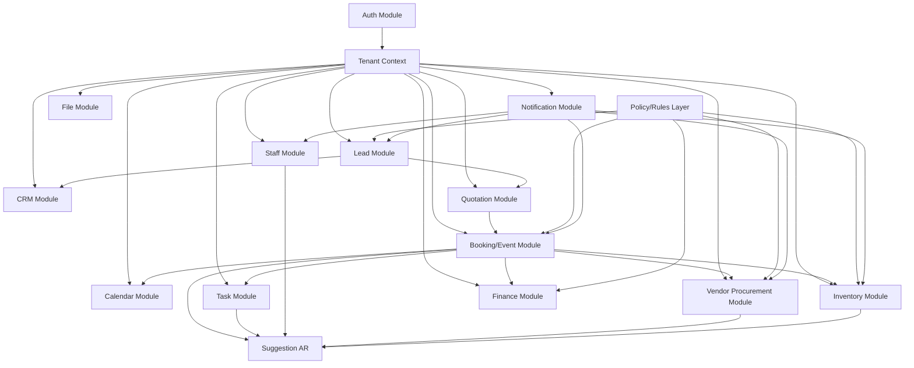
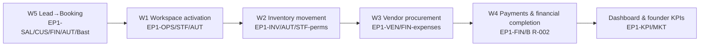

# Event OS Implementation Specification

## Document Metadata

| Field | Value |
|-------|-------|
| **Document Owner** | Founding Engineering |
| **Primary Reviewer** | Ilyas + Zakir (We Decor Events) |
| **Status** | Draft — engineering handoff |
| **Version** | 1.1 |
| **Created Date** | 2026-07-08 |
| **Last Updated** | 2026-07-08 |
| **Next Review Date** | Not Defined |
| **Document Purpose** | Define exactly how Phase 1 will be implemented (engineering playbook) without writing application code. This document is an implementation handoff from the approved architecture phase into Sprint execution. |

---

## Version History

| Version | Date | Author | Summary of Changes |
|---------|------|---------|---------------------|
| 1.0 | 2026-07-08 | Founding Engineering | Initial Phase 1 implementation playbook based on domain, data, API, ADR-016 and ADR-017 |
| 1.1 | 2026-07-08 | Founding Engineering | Sprint API lists synchronized with `docs/09-api-design.md` — complete command and read endpoint coverage per workflow |

---

## Purpose

This document is the engineering handoff from architecture to implementation.

It defines:

- Implementation principles (layers, transactions, repositories, validation, exceptions, logging, audit)
- Module packaging and responsibilities
- Domain event publishing and ADR-017 suggestion processing rules
- Tenant context handling (ADR-016)
- A Phase 1 sprint plan that implements workflows W5 → W1 → W2 → W3 → W4 → Dashboard, with exact EP1 coverage and acceptance criteria

This document must not expand Phase 1 scope.

---

## Scope

### In scope

Phase 1 implementation rules and sprint execution plan for We Decor single tenant:

- Core modules needed to complete must-pass workflows W1–W5 and deliver founder dashboard KPIs
- Cross-cutting platform modules required to run those workflows (Auth/Tenant/Notification/File/Policy)
- Suggestion-only behavior per ADR-017
- Single-tenant mode assumptions per ADR-016

### Out of scope (deferred)

The following are explicitly out of Phase 1 implementation scope and must not block:

- Multi-tenant SaaS lifecycle (Doc `20`)
- AI assistant core (Phase 5+)
- Full WhatsApp replacement (Phase 5+)
- Client portal (Phase 4+)
- Full CMS and advanced marketing platform (Phase 4+)
- Advanced BI beyond founder KPIs (Phase 5+)

---

## References

| Document | Role |
|----------|------|
| `docs/business/19-event-os-phase1-requirements.md` | Frozen Phase 1 business baseline (EP1 IDs, W1–W5) |
| `docs/07-domain-model.md` | Authoritative domain model |
| `docs/08-data-model.md` | Logical persistence and persistence rules |
| `docs/09-api-design.md` | REST API contract (implementation blueprint) |
| `docs/05-system-architecture.md` | Architecture and tenancy + automation policy |
| `docs/06-module-design.md` | Module boundaries and responsibilities |
| `docs/11-roadmap.md` | Phase placement and transition strategy |
| `docs/12-architecture-decisions.md` | ADR-016 and ADR-017 details |
| `docs/14-security-principles.md` | Validation, authorization, tenant isolation, audit expectations |
| `docs/15-testing-strategy.md` | Testing philosophy and test types |
| `docs/10-folder-structure.md` | Packaging/layout rules for the codebase |
| `docs/18-api-standards.md` | REST semantics, pagination, error envelope |

---

## Implementation Principles

### Single source of truth

- The Event aggregate (Booking) is the operational source of truth after **Approved**.
- Customer, Lead, Quotation remain authoritative for their bounded contexts until conversion.

### Module boundaries enforced by code structure

- No module directly queries another module’s persistence tables.
- Cross-module reads happen through public application service interfaces or read models.
- Cross-module side effects happen via domain events (in-process Phase 1) and/or suggestion/alert records (ADR-017).

### No auto-execution in Phase 1

- Domain-event handlers must not mutate business aggregates or send outbound customer/vendor communications.
- In Phase 1, handlers create **Suggestions** and/or **in-app alerts** only (ADR-017).
- User-triggered commands or suggestion acceptance endpoints cause the actual business action.

### Hard blocks enforced in application layer

Enforce EP1-BR-001, EP1-BR-002, EP1-BR-003 before any state mutation:

- EP1-BR-001: advance required before Approved
- EP1-BR-002: financial review required before Completed
- EP1-BR-003: execution ownership required before execution stage advances

### Tenant context immutable input

- Use ADR-016: resolve `tenantId` from authentication context; never accept tenant identifiers from the request.

---

## Package Structure

Code package structure must follow `docs/10-folder-structure.md`.

### Repository / module layout

- Backend application lives under `apps/api/src/`
- Each Phase 1 module is implemented as a NestJS module under `apps/api/src/modules/{module-name}/`
- Each module follows the standard folder structure:
  - `domain/` (entities, value objects, domain services, domain events, repository interfaces, errors)
  - `application/` (commands, queries, DTOs, application service orchestrators)
  - `infrastructure/` (persistence implementations, event handlers)
  - `presentation/` (controllers and request validation — not produced here)
  - `__tests__/` (unit/integration tests)

This implementation specification focuses on what goes where and how it behaves, not on writing code.

---

## Module Dependency Rules

### Dependency direction

Use the architectural dependency rule from `docs/05-system-architecture.md`:

- Presentation → Application → Domain ← Infrastructure

### No circular dependencies

- A bounded context can depend on public application service interfaces for synchronous reads.
- Infrastructure dependencies must implement domain repository interfaces.
- Domain layer never depends on infrastructure or presentation.

### Cross-module data access

- Never implement cross-module reads with SQL joins across module boundaries (Phase 1).
- For performance read models (Founder KPI / profitability), use explicit read model derivation in the Finance/BI path.

---

## Layer Responsibilities

### Domain layer

- Enforce business invariants and lifecycle rules for each aggregate/entity
- Publish domain events after state changes
- Provide pure domain services (no I/O, no HTTP, no DB)

### Application layer

- Authenticate/authorize via TenantContext and permission checks
- Validate request payloads (schema-level) + enforce business preconditions (hard blocks)
- Orchestrate transactions around one or more aggregate changes
- Call domain services; persist aggregates through repositories
- Trigger domain event publishing only after transaction commit (ADR-012)

### Infrastructure layer

- Implement repositories with tenant-scoped persistence
- Implement domain event handlers (in-process Phase 1) that write suggestions/alerts only (ADR-017)
- Implement file storage adapter (object storage, signed URLs)

### Presentation layer

- Thin controllers that:
  - Map REST request → command/query
  - Return API-standard success/error envelopes
  - Never implement business logic

---

## Transaction Strategy

### Default transaction rule

Each state-changing application service method runs within a database transaction boundary:

- Persist all aggregate changes inside a transaction
- Domain events are captured during the transaction and published after commit (ADR-012)

### Command-scoped boundaries (Phase 1)

These transaction groupings must be used consistently:

1. Lead → Booking conversion command:
   - Persist Lead stage and stage history
   - Persist Customer (if created)
   - Persist Quotation header + line items (if created/updated in the same command)
   - Persist Payment record needed to satisfy EP1-BR-001 (advance confirmation gating)
   - Persist Event (Booking) in Approved state (conversion chain)
   - Persist Suggestion(s) produced by domain event handlers after commit (ADR-017)

2. Workspace activation via suggestion acceptance:
   - Persist Suggestion acceptance state
   - Execute workspace activation action (create/activate Event Workspace view and execution progress defaults)
   - Domain events may produce follow-up suggestions/alerts (still suggestion-only until user accepts)

3. Inventory movement transitions:
   - Persist InventoryMovement state transition and timestamps
   - Persist packing list and checklist linkage only through accepted checklist generation flows
   - Update any derived inventory availability in the same transaction if needed by domain rules

4. Vendor procurement transitions:
   - Persist VendorProcurement and ProcurementLine transitions
   - Persist VendorExpense (vendor payment/expense) only when the command is invoked

5. Completion:
   - Enforce EP1-BR-002 within the completion command
   - Persist Event Completed status
   - Trigger read model refresh (BI) through derived projections (not business mutations)

---

## Repository Strategy

### Base repository (tenant scoped)

All repositories must:

- Scope every query/mutation to `tenant_id`
- Respect soft deletion / cancellation rules (e.g. filter by `deleted_at IS NULL` or status)
- Provide aggregate-root persistence methods that accept full domain entities

### Aggregate root persistence

- Implement “save/load by aggregate root id” for each aggregate root:
  - Customer, Lead, Quotation, Event, StaffMember, Vendor, InventoryItem, InventoryMovement, Task, Payment, Invoice, VendorExpense, Suggestion, CalendarEntry
- Owned entities are persisted via child tables or embedded records under the aggregate root owner.

### Optimistic concurrency

- Use `version` checks for update commands.
- For optimistic concurrency failures:
  - Return error code `CONCURRENT_MODIFICATION` (409) mapped to API standard errors.

---

## Service Design Principles

### Application service granularity

- One public method per use case (command/query)
- Application services do orchestration only, without domain invariants
- Application services are responsible for:
  - Permission checks
  - Business preconditions (hard blocks)
  - Transaction boundaries

### Domain services

- Domain services implement logic that does not fit entities:
  - Profitability calculation (read model derivation)
  - Procurement variance comparison checks
  - Conversion chain orchestration across aggregates as domain-level workflow (if needed)

---

## Domain Event Publishing Strategy

### In-process event bus (Phase 1)

- ADR-012: use in-process event bus
- Publish domain events after the database transaction commits

### Handler constraints (ADR-017)

Handlers must:

- Create Suggestions and/or In-app alerts
- Not mutate business aggregates directly
- Not send customer/vendor messages
- Not advance execution stages or mark completion

### Suggested handler categories

1. Suggestion factory:
   - Creates `workspace.create`, `checklist.generate`, `staff.assign` suggestions when required
2. Alert factory:
   - Creates in-app alerts for pending human steps (approval gates)

---

## Suggestion Processing (ADR-017)

### Suggestion persistence

- Suggestions are persisted in the shared platform area (Suggestion AR)
- Each suggestion has:
  - `type` (what action to perform)
  - `aggregate_type` + `aggregate_id` target
  - `payload` JSON (parameters)
  - `status` (pending/accepted/dismissed/expired)

### Suggestion acceptance command

When a user calls `POST /api/v1/suggestions/:id/accept`:

1. Validate suggestion is `pending`
2. Validate permissions for the suggestion type category
3. Execute the target use case:
   - The target application service method is executed in a transaction boundary
   - Target execution enforces all hard blocks again defensively
4. Mark suggestion as `accepted` (and store resolution metadata)
5. Emit any domain events
6. Handlers may generate additional suggestions/alerts (still suggestion-only)

### Suggestion dismissal command

On dismiss:

- Mark suggestion dismissed + audit
- Do not execute target action
- Optionally record dismissal reason (payload/comment)

---

## Tenant Context (ADR-016)

### Resolution

Per `docs/05-system-architecture.md`:

- Request → Auth middleware → Load org context → set request-scoped `OrgContext`
- `tenantId` is fixed for We Decor in Phase 1

### Enforcement

Application layer must ensure:

- No tenant scoping fields are accepted from request body
- Repositories apply tenantId filter
- Permission checks always evaluate for current tenant

---

## Validation Strategy

Layered validation:

1. API boundary schema validation (Zod; see security + standards)
2. Tenant scoping validation
3. Business precondition validation:
   - hard blocks (EP1-BR-001–003)
4. Domain invariant validation inside entities/services
5. Optimistic concurrency validation on updates

---

## Exception Strategy

Use a consistent exception mapping to API errors:

- Domain errors (domain invariant violations) → `409 CONFLICT` with domain-specific error codes
- Validation failures → `400 VALIDATION_ERROR`
- Missing resources → `404 NOT_FOUND`
- Permission failures → `403 FORBIDDEN`
- Concurrency failure → `409 CONCURRENT_MODIFICATION`
- Expired resources → `422 QUOTATION_EXPIRED` (or similar mapped code)

Ensure all error responses contain:

- `code`
- `message`
- `details` (field-level if applicable)
- `requestId` correlation id

---

## Logging Strategy

Use structured logging (pino) per architecture decisions:

- Log correlation:
  - `requestId` from API layer
  - `tenantId`
  - `userId`
  - `aggregateType` + `aggregateId` when relevant
- Log categories:
  - security/authorization
  - transaction start/commit/rollback (debug level)
  - domain event publishing (debug)
  - suggestion creation/acceptance (info)
  - unexpected internal errors (error)

Avoid logging sensitive content:

- payment proofs, file keys, secrets, credentials

---

## Audit Strategy

Sensitive actions must be audit logged:

- Suggestion accept/dismiss (ADR-017)
- Lead stage transitions (especially to Approved)
- Payment recording/voiding
- Procurement line transitions (especially Confirmed/Completed)
- Inventory movement transitions (especially Packed/Loaded/At Venue)
- Event completion (EP1-BR-002 enforcement)

Audit log entries must include:

- actor (userId)
- tenantId
- action type
- target aggregate identifiers
- timestamps
- before/after status summaries (not full sensitive payloads)

---

## File Storage Strategy

Attachments use object storage (S3-compatible):

- Upload:
  - validate file at API boundary
  - store blob under tenant-scoped path
- Retrieval:
  - generate signed URL
- Attachment metadata:
  - stored in File module (files table) and referenced by id from domain entities

Path convention (architecture):

`{tenantId}/{module}/{entityId}/{filename}`

---

## Testing Strategy

Phase 1 testing must follow `docs/15-testing-strategy.md`:

### Unit tests (domain + application)

- Validate domain invariants:
  - lead stage transition rules
  - inventory movement state reachability
  - procurement transitions
  - hard blocks enforcement via domain/application checks

### Integration tests (API endpoints + DB)

- Validate:
  - tenant scoping
  - optimistic concurrency behavior
  - correct error mapping
  - suggestion creation/acceptance flow correctness (ADR-017)

### E2E tests (critical journeys)

At minimum:

- Lead to Booking (W5)
- Approved Booking to workspace activation (W1)
- Event Preparation to inventory movement state machine (W2)
- Event to vendor procurement workflow (W3)
- Customer payment to completion (W4)
- Founder KPI dashboard read (Sprint 6)

---

## Migration Strategy (Existing System Reuse)

Phase 1 requires parallel operation during transition (see `docs/11-roadmap.md` and `docs/08-data-model.md`).

Implementation must support a migration path that does not add new features:

1. Seed We Decor tenant and initial configuration
2. Provide importers (one-time scripts or manual admin tooling) for:
   - Lead/Customer identity mapping from Lead Management Application
   - Quotation records (selectively, for initial cutover)
3. Keep legacy systems operational until Phase 1 UAT passes:
   - Lead pipeline states remain usable while Event OS extends lead module
   - Quotation/billing stays stable while Event OS reuses and migrates its patterns
4. Inventory/vendor initial masters:
   - In Phase 1, masters can be created manually by operators if migration is incomplete
   - Do not fabricate facts; missing inventory/vendor details are allowed as “Not Defined”

No migration scripts are specified here; only the order-of-operations and ownership.

---

## Existing System Reuse Strategy

Re-use patterns, do not rebuild business workflows:

### Lead Management Application

- Reuse lead pipeline/status concepts
- Extend with unified customer identity and follow-ups
- Website contact intake must persist into the Event OS Lead module

### Quotation / Billing Application

- Reuse quotation PDF/GST line item patterns
- During transition, Event OS quotation billing runs in parallel and maps into unified Event record

### We Decor Website

- Keep SEO surface; integrate contact intake to create persisted Lead records

---

## Dependency Diagrams (Module-level)

### Phase 1 module dependencies

---

## Module-by-Module Implementation Playbook

Each module entry includes:

- Package name (code location)
- Application services
- Domain services
- Repositories
- Domain events published/consumed
- External integrations (Phase 1)
- Transaction boundaries (high level)

### Conventions

- “Domain events published/consumed” refer to Phase 1 event bus flow (in-process, ADR-012) and ADR-017 suggestion/alert creation.
- “Transaction boundary” indicates which aggregates are persisted in a single transaction for common commands.

---

### Platform Modules

#### Auth Module

- **Package name:** `apps/api/src/modules/auth/`
- **Application services:** `AuthService`
- **Domain services:** none (auth mostly infrastructure)
- **Repositories:** `UserRepository`, `SessionRepository`
- **Domain events published:** `UserLoggedIn`, `PasswordChanged` (optional in-process events)
- **Domain events consumed:** none
- **External integrations:** none
- **Transaction boundary:** token/session updates only
- **Related EP1 IDs:** EP1-STF-003 (through authorization checks on protected operations)

#### Tenant Module (minimal We Decor single tenant)

- **Package name:** `apps/api/src/modules/tenant/`
- **Application services:** `TenantService`, `TenantSettingsService` (read + update only in Phase 1)
- **Domain services:** none
- **Repositories:** `TenantRepository`, `TenantSettingsRepository`
- **Domain events published:** `TenantSettingsUpdated` (if updated)
- **Domain events consumed:** none
- **External integrations:** none
- **Transaction boundary:** settings updates atomic
- **Related EP1 IDs:** none dedicated (supports all modules)

#### Notification Module

- **Package name:** `apps/api/src/modules/notification/`
- **Application services:** `NotificationService`
- **Domain services:** none
- **Repositories:** `NotificationRepository`
- **Domain events published:** `NotificationSent` (optional), `NotificationDelivered` (informational)
- **Domain events consumed:** business events that trigger in-app notifications after approval gates allow it
- **External integrations:** push (FCM) + in-app only in Phase 1; WhatsApp delivery is deferred
- **Transaction boundary:** send notification is best-effort; do not roll back business transaction if notification delivery fails (handlers should be resilient)
- **Related EP1 IDs:** EP1-SAL-006, EP1-AUT-005

#### File Module

- **Package name:** `apps/api/src/modules/file/`
- **Application services:** `FileService`
- **Domain services:** none
- **Repositories:** `FileRepository`
- **Domain events published:** `FileUploaded`, `FileDeleted`
- **Domain events consumed:** entity deletion events (cleanup policy)
- **External integrations:** object storage (S3-compatible)
- **Transaction boundary:** metadata persist is atomic; blob upload may be executed before/after metadata depending on implementation; ensure consistency via compensating actions
- **Related EP1 IDs:** EP1-FIN-003 (proofs), EP1-INV-007 (photos), EP1-MKT-003 (content library adjunct)

#### Policy / Rules Layer

- **Package name:** `apps/api/src/modules/policy/` (or shared “policy” library)
- **Application services:** `BusinessRuleEnforcementService`
- **Domain services:** hard block enforcement helpers
- **Repositories:** none (uses query services as needed)
- **Domain events published/consumed:** none
- **External integrations:** none
- **Transaction boundary:** called inside transaction preconditions
- **Related EP1 IDs:** EP1-AUT-001, EP1-AUT-005, EP1-BR-001–EP1-BR-004 (Phase 1 uses EP1-BR-004 warn/recommend-only)

---

### Business Modules (Phase 1)

#### Lead Module

- **Package name:** `apps/api/src/modules/lead/`
- **Application services:**
  - `LeadService`
  - `FollowUpService`
- **Domain services:**
  - `LeadPipelineDomainService` (stage transition rules)
- **Repositories:** `LeadRepository`, `FollowUpRepository`, `LeadStageHistoryRepository`
- **Domain events published:**
  - `LeadCreated`
  - `LeadStageChanged`
  - `LeadAssigned`
  - `LeadQualified` (if applicable within Phase 1)
  - `LeadConverted` (to Approved Event chain as triggered by domain conversion)
- **Domain events consumed:**
  - suggestion-only hints that require follow-up scheduling (if produced by other modules; optional)
- **External integrations:** none (website intake persists as create lead command)
- **Transaction boundary:**
  - create lead command
  - stage transition command (includes stage history)
  - conversion triggers must be coordinated with Booking/Quotation/Payment in one use case where business requires atomicity
- **Related EP1 IDs:** EP1-SAL-001–006, EP1-AUT-006

#### Customer (CRM) Module

- **Package name:** `apps/api/src/modules/crm/`
- **Application services:** `CustomerService`, `TimelineService`, `IssueService`, `ReviewRequestService`
- **Domain services:** customer invariant enforcement helpers
- **Repositories:** `CustomerRepository`, `ContactRepository`, `TimelineRepository`, `IssueNoteRepository`, `ReviewRequestRepository`
- **Domain events published:**
  - `ClientCreated` / `ContactAdded`
  - `TimelineEntryAdded`
  - `IssueNoteCreated`
  - `ReviewRequestCreated`
- **Domain events consumed:**
  - `LeadConverted` (optional: link or update customer references)
- **External integrations:** none
- **Transaction boundary:**
  - create/update customer
  - append timeline
  - create issue/review request
- **Related EP1 IDs:** EP1-CUS-001–004, EP1-SUP-001–003

#### Quotation Module

- **Package name:** `apps/api/src/modules/quotation/`
- **Application services:** `QuotationService`, `QuotationLineItemService`, `QuotationPdfService` (conceptual)
- **Domain services:**
  - `QuotationLifecycleDomainService`
- **Repositories:** `QuotationRepository`, `QuotationLineItemRepository`
- **Domain events published:**
  - `QuotationCreated`
  - `QuotationSent`
  - `QuotationApproved`
  - `QuotationRejected`
  - `QuotationExpired` (if scheduled; optional)
  - `QuotationSuperseded` / version chain events
- **Domain events consumed:**
  - none in Phase 1; downstream conversion can be handled via Booking module through consumed `QuotationApproved`
- **External integrations:** PDF generation (library) + optional email/FCM notification channel integration (but outbound comms gating must be enforced)
- **Transaction boundary:**
  - create quotation (draft)
  - update quotation (draft)
  - approve/reject/revise commands
  - approved quotation conversion chain must be treated atomically with Booking creation use case (where business expects it)
- **Related EP1 IDs:** EP1-FIN-001, EP1-AUT-006, EP1-AUT-005

#### Booking (Event Hub) Module

- **Package name:** `apps/api/src/modules/booking/`
- **Application services:** `BookingService`, `ExecutionProgressService`
- **Domain services:**
  - `BookingLifecycleDomainService`
  - `ExecutionProgressDomainService`
- **Repositories:** `EventRepository`, `ExecutionProgressRepository` (and related owned state persistence)
- **Domain events published:**
  - `EventWorkspaceActivated`
  - `EventCompleted`
- **Domain events consumed:**
  - `QuotationApproved` (conversion into operational event record)
  - `LeadConverted` (optional alternative trigger; primary trigger should be QuotationApproved in domain)
- **External integrations:** none
- **Transaction boundary:**
  - booking create/confirm conversion
  - status updates
  - cancel/complete commands (complete enforces EP1-BR-002)
  - execution milestone advance enforces EP1-BR-003
- **Related EP1 IDs:** EP1-OPS-001, EP1-OPS-004, EP1-OPS-005, EP1-BR-002–EP1-BR-003, EP1-AUT-002

#### Calendar Module

- **Package name:** `apps/api/src/modules/calendar/`
- **Application services:** `CalendarService`
- **Domain services:** calendar conflict helpers (warn-only where permitted by Phase 1 policy)
- **Repositories:** `CalendarEntryRepository`
- **Domain events published:**
  - `CalendarEntryCreated`
- **Domain events consumed:**
  - `EventWorkspaceActivated` to create ops milestones entries
- **External integrations:** none
- **Transaction boundary:** create/update entries in same transaction as conversion if required for atomic user experience
- **Related EP1 IDs:** EP1-OPS-005

#### Task Module

- **Package name:** `apps/api/src/modules/task/`
- **Application services:** `TaskService`, `ChecklistService` (invoked when checklist generation is accepted)
- **Domain services:** task lifecycle enforcement
- **Repositories:** `TaskRepository`, `ChecklistItemRepository`
- **Domain events published:**
  - `TaskCreated`
  - `TaskUpdated`
  - `TaskCompleted`
- **Domain events consumed:**
  - `EventWorkspaceActivated` (optional: initial checklist visibility)
  - suggestion acceptance flows for checklist generation (handled by acceptance command calling TaskService)
- **External integrations:** none
- **Transaction boundary:** create/update status commands; checklist generation acceptance creates tasks + owned checklist items atomically
- **Related EP1 IDs:** EP1-OPS-003, EP1-AUT-003

#### Staff Module

- **Package name:** `apps/api/src/modules/staff/`
- **Application services:** `StaffService`, `StaffAssignmentService` (assignment recommendations)
- **Domain services:** staff validity rules
- **Repositories:** `StaffMemberRepository`, `StaffAssignmentRepository` (or event-linked assignment table)
- **Domain events published:**
  - `StaffAssignmentConfirmed`
- **Domain events consumed:**
  - `EventWorkspaceActivated` (optional: refresh assignment recommendations)
- **External integrations:** none
- **Transaction boundary:** staff master CRUD commands and staff assignment acceptance actions in one transaction
- **Related EP1 IDs:** EP1-STF-001–002, EP1-AUT-004, EP1-STF-003 (authorization gates)

#### Vendor Procurement Module

- **Package name:** `apps/api/src/modules/vendor/`
- **Application services:** `VendorService`, `VendorProcurementService`, `ProcurementLineService`
- **Domain services:** procurement state machine rules and issue note rules
- **Repositories:** `VendorRepository`, `VendorProcurementRepository`, `ProcurementLineRepository`, `VendorIssueNoteRepository`, `ProcurementLineIssueNoteRepository`
- **Domain events published:**
  - `ProcurementLineStatusChanged`
  - `ProcurementLineIssueNoteAdded` (where applicable)
- **Domain events consumed:** none required if procurement transitions are direct human commands; handlers may create informational suggestions/alerts only
- **External integrations:** none
- **Transaction boundary:** create procurement header, create procurement lines, transition procurement state, append issue notes all within one command transaction
- **Related EP1 IDs:** EP1-VEN-001–006, EP1-FIN-004 (vendor expense links), EP1-AUT-005

#### Inventory Module

- **Package name:** `apps/api/src/modules/inventory/`
- **Application services:** `InventoryService`, `InventoryMovementService`, `PackingListService`
- **Domain services:** movement state machine, packing list generation rules (draft generation becomes a suggestion until accepted)
- **Repositories:** `InventoryItemRepository`, `InventoryMovementRepository`, `PackingListRepository`, `DamageNoteRepository`, plus attachment linkage references
- **Domain events published:**
  - `InventoryMovementStateChanged`
- **Domain events consumed:** optional `PackingListDraftReady` notifications as internal signals
- **External integrations:** none
- **Transaction boundary:** create movement in planned state, transition movement states, attach photos, append damage notes each as atomic command transactions
- **Related EP1 IDs:** EP1-INV-001–007, EP1-AUT-003, EP1-AUT-005, EP1-STF-003

#### Finance Module

- **Package name:** `apps/api/src/modules/finance/`
- **Application services:** `PaymentService`, `InvoiceService`, `ExpenseService`, `ProfitabilityService`
- **Domain services:**
  - `PaymentLifecycleDomainService`
  - `ExpenseLifecycleDomainService`
  - `ProfitabilityDerivationDomainService`
- **Repositories:** `PaymentRepository`, `InvoiceRepository`, `VendorExpenseRepository`
- **Domain events published:**
  - `PaymentRecorded`
  - `InvoiceCreated` / `InvoiceSent` / `InvoiceVoided` (if invoicing is part of the Phase 1 revenue basis)
  - `ExpenseRecorded` / `ExpenseVoided` (vendor expense proof lifecycle)
- **Domain events consumed:**
  - `EventCompleted` and/or `PaymentRecorded` to refresh profitability read models
- **External integrations:** none in Phase 1 (no payment gateway integration)
- **Transaction boundary:** record payment, void payment, record expense, create/send/void invoice, and compute profitability reads (read models) via derived projection logic
- **Related EP1 IDs:** EP1-FIN-001–005, EP1-BR-001–002, EP1-KPI-004

#### BI / Dashboard Module (Founder KPIs only)

- **Package name:** `apps/api/src/modules/bi/`
- **Application services:** `DashboardService`
- **Domain services:** KPI derivation helpers (read model only)
- **Repositories:** read model repositories
- **Domain events published:** none required (read model refresh is internal)
- **Domain events consumed:** payment/expense/lead events that change KPI aggregates
- **External integrations:** none
- **Transaction boundary:** update or refresh read models transactionally with source-of-truth operations if implemented synchronously; otherwise via background jobs (Phase 2+). For Phase 1, keep refresh consistent and deterministic for UAT.
- **Related EP1 IDs:** EP1-KPI-001–007, EP1-MKT-001–002

---

### Administration Module (Cross-cutting commands)

#### Administration / Suggestions

- **Package name:** `apps/api/src/modules/admin/` (or `suggestions/` shared platform module)
- **Application services:** `SuggestionService`, `TenantSettingsService` (Phase 1 minimal update)
- **Domain services:** suggestion type routing and lifecycle rules
- **Repositories:** `SuggestionRepository` (and optional in-app alert repository if separate)
- **Domain events published:**
  - `SuggestionAccepted` / `SuggestionDismissed`
- **Domain events consumed:** none; it is a command-entry module
- **External integrations:** none
- **Transaction boundary:** accept/dismiss commands update suggestion status and then invoke the target application service (same transaction or transaction boundary strategy must be defined; recommended: execute target action and suggestion update atomically in one transaction)
- **Related EP1 IDs:** EP1-AUT-001–EP1-AUT-006

---

## Implementation Order by Sprint (Workflow-first)

Note: sprint numbers in this document are ordered by workflow (W5→W1→W2→W3→W4→Dashboard) as requested for engineering execution. This ordering may differ from the indicative sprint blocks in `docs/11-roadmap.md`; the EP1 scope and UAT must-pass mapping still comes from `docs/business/19-event-os-phase1-requirements.md`.

### Sprint 1 — W5 Lead → Booking

Goal: implement the end-to-end lead capture and conversion chain up to an **Approved Event** (unified event record created) with suggestion(s) for Event Workspace activation queued.

1) **EP1 IDs implemented**
**Must-pass (W5) EP1 IDs (Doc 19 §5):**
- EP1-SAL-001
- EP1-SAL-002
- EP1-SAL-005
- EP1-AUT-006
- EP1-BR-001

**Supporting EP1 IDs (required to make W5 usable end-to-end):**
- EP1-CUS-001 (no duplicate Customer during conversion)
- EP1-AUT-001, EP1-AUT-005 (no auto-execution + approval gate enforcement)
- EP1-FIN-001 (quotation base used by the conversion chain)
- EP1-AUT-002 (queue workspace activation suggestion at Approved)

2) **Aggregates involved**

- Lead, FollowUp
- Customer, Contact
- Quotation, QuotationLineItem
- Payment (advance gating; store enough to satisfy EP1-BR-001)
- Event (Booking / unified event record)
- Suggestion (pending, type workspace.create)

3) **APIs required**

Per `docs/09-api-design.md`. Endpoint paths below are sprint-bound for W5 implementation and UAT.

**State-changing (commands):**

- Lead:
  - `POST /api/v1/leads`
  - `PATCH /api/v1/leads/:id/stage`
  - `POST /api/v1/leads/:id/assign`
  - `POST /api/v1/leads/:id/follow-ups`
  - `PATCH /api/v1/follow-ups/:id`
- Customer (conversion chain; EP1-CUS-001):
  - `POST /api/v1/clients`
  - `PATCH /api/v1/clients/:id`
  - `POST /api/v1/clients/:id/contacts`
- Quotation:
  - `POST /api/v1/quotations`
  - `PATCH /api/v1/quotations/:id`
  - `POST /api/v1/quotations/:id/line-items`
  - `PATCH /api/v1/quotations/:id/line-items/:itemId`
  - `DELETE /api/v1/quotations/:id/line-items/:itemId`
  - `POST /api/v1/quotations/:id/send`
  - `POST /api/v1/quotations/:id/approve`
  - `POST /api/v1/quotations/:id/reject` (negative path; optional UAT)
  - `POST /api/v1/quotations/:id/revise`
- Payment (advance):
  - `POST /api/v1/payments` (used to satisfy EP1-BR-001 before conversion)

**Reads (UI / UAT / workflow visibility):**

- `GET /api/v1/leads`
- `GET /api/v1/leads/:id`
- `GET /api/v1/clients/:id` (duplicate-customer verification during conversion)
- `GET /api/v1/quotations/:id`
- `GET /api/v1/quotations/:id/pdf`
- `GET /api/v1/bookings/:id` (conversion verification)
- `GET /api/v1/suggestions?status=pending` (workspace activation suggestion queued)

**Read coverage notes:**

- Lead pipeline kanban view uses `GET /api/v1/leads/pipeline` (deferred to Sprint 6 dashboard/KPI context; not required for W5 happy-path UAT).
- `GET /api/v1/quotations` (list) and `GET /api/v1/clients` (list) are omitted — W5 UAT uses single-enquiry happy path via `GET /api/v1/leads/:id` and `GET /api/v1/quotations/:id`.

4) **Database entities required (logical)**

- Lead + lead stage history
- FollowUp
- Customer + Contact
- Quotation + QuotationLineItem
- Payment
- Event (Booking) + execution progress defaults
- Suggestion (pending)

5) **Acceptance criteria**

- A lead can be captured and progressed to a state that results in an Approved Event (W5 passes)
- The advance-before-Approved hard block (EP1-BR-001) is enforced in application layer
- Lead → Customer → Quotation → Event chain creates a single unified event record (EP1-AUT-006)
- At Approved, the system queues a `workspace.create` suggestion for human activation (ADR-017)
- UAT W5 happy-path integration test exists (E2E)

6) **Dependencies**

- Auth/Tenant context resolution
- Tenant-scoped repositories and validation at API boundary
- Notification/File modules may be stubbed but must not violate constraints (no auto-execution)

7) **Risks**

- Advance payment gating depends on correct sequencing between lead approval and payment record creation (confirm UI flow and test data strategy)
- Cross-module transactional atomicity for conversion chain (must not create partial data)

---

### Sprint 2 — W1 Approved Booking → Event Workspace

Goal: implement workspace activation and provide Zakir’s single pane experience: execution stage tracking + tasks/checklists + staff assignment recommendations are visible after workspace activation.

1) **EP1 IDs implemented**
**Must-pass (W1) EP1 IDs (Doc 19 §5):**
- EP1-BR-001
- EP1-OPS-001
- EP1-OPS-003
- EP1-OPS-004
- EP1-STF-002
- EP1-AUT-002

**Supporting EP1 IDs (required UX after Approved):**
- EP1-AUT-005 (human-approval gates)
- EP1-STF-001 (staff master usable for assignment recommendations)
- EP1-AUT-003 (checklist draft generation via suggestions, consumed before W2 confirmations)
- EP1-AUT-004 (staff.assign suggestion accept path)
- EP1-BR-003 (execution ownership hard block)

2) **Aggregates involved**

- Event
- ExecutionProgress (owned state)
- Task + ChecklistItem
- StaffMember + StaffAssignment
- Suggestion

3) **APIs required**

Per `docs/09-api-design.md`. Endpoint paths below are sprint-bound for W1 implementation and UAT.

**State-changing (commands):**

- Workspace activation (ADR-017 — two valid entry points invoking the identical
  `WorkspaceService.activateWorkspace()` use case):
  - `POST /api/v1/bookings/:id/activate-workspace` (direct human command; primary path for this
    sprint, independent of Suggestion subsystem delivery status)
  - `POST /api/v1/suggestions/:id/accept` (accept `workspace.create`; optional, once the Suggestion
    subsystem exists)
- Suggestions (ADR-017, for `checklist.generate` and `staff.assign`):
  - `POST /api/v1/suggestions/:id/accept` (accept `checklist.generate`)
  - `POST /api/v1/suggestions/:id/accept` (accept `staff.assign`)
  - `POST /api/v1/suggestions/:id/dismiss`
- Execution progress (EP1-OPS-004, EP1-BR-003):
  - `POST /api/v1/bookings/:id/execution-stages/advance`
  - `PATCH /api/v1/bookings/:id/status`
- Staff master:
  - `POST /api/v1/staff`
  - `PATCH /api/v1/staff/:id`
- Tasks and checklists:
  - `POST /api/v1/tasks`
  - `PATCH /api/v1/tasks/:id`
  - `PATCH /api/v1/tasks/:id/status`
- Customer support (event-scoped; supporting EP1-CUS-002–004):
  - `POST /api/v1/clients/:id/interactions`
  - `POST /api/v1/events/:eventId/issues`
  - `POST /api/v1/events/:eventId/review-requests`

**Reads (UI / UAT / workflow visibility):**

- `GET /api/v1/bookings/:id`
- `GET /api/v1/bookings` (approved events list; Z1)
- `GET /api/v1/bookings/:id/workspace` (workspace status, preparation status, execution owner)
- `GET /api/v1/clients/:id/interactions` (communication timeline; EP1-CUS-002)
- `GET /api/v1/tasks?bookingId=...` (task and checklist item visibility)
- `GET /api/v1/tasks/:id`
- `GET /api/v1/staff`
- `GET /api/v1/staff/:id`
- `GET /api/v1/suggestions?status=pending`

**Read coverage notes:**

- Checklist items are owned by the `Task` aggregate and are returned via `GET /api/v1/tasks?bookingId=...` — not via the workspace read model (`GET /api/v1/bookings/:id/workspace` returns workspace status fields only; see `docs/09-api-design.md`).
- Staff assignment recommendations appear as pending suggestions until accepted via `POST /api/v1/suggestions/:id/accept` (`staff.assign`).

4) **Database entities required (logical)**

- Event workspace activation state (within Event aggregate / owned data)
- ExecutionProgress (milestones/preparationStatus)
- Task + ChecklistItem
- StaffMember
- StaffAssignment (event-linked)
- Suggestion records for checklist and staff assignment

5) **Acceptance criteria**

- W1 passes: after Approved booking exists, workspace activation is human-confirmed and creates the correct view
- Execution progress fields exist and are updatable in application layer (EP1-OPS-004 + EP1-BR-003 enforced for stage advances)
- Staff assignment recommendations are presented as a pending suggestion and can be accepted by Zakir
- Checklists/checklist tasks are visible (even if still draft) and created through suggestion acceptance paths (ADR-017)

6) **Dependencies**

- Suggestion persistence and accept/dismiss routing is **not** yet built as of Sprint 1 and must be
  delivered within this sprint for the `checklist.generate` and `staff.assign` suggestion flows.
- Workspace activation (EP1-OPS-001, EP1-AUT-002) does **not** depend on the Suggestion subsystem:
  `POST /api/v1/bookings/:id/activate-workspace` is a direct human command per ADR-017 and is usable
  independent of Suggestion delivery status. Suggestion acceptance (`workspace.create`) remains an
  optional future entry point into the same `WorkspaceService.activateWorkspace()` use case once the
  Suggestion subsystem is built — it is not a prerequisite for this workflow.
- Staff master CRUD for EP1-STF-001 exists by end of Sprint 2

7) **Risks**

- Domain-event-to-suggestion creation timing (handlers must not auto-execute; ensure suggestions are generated consistently after Approved)

---

### Sprint 3 — W2 Event Preparation → Inventory Movement

Goal: implement inventory movement state machine and packing checklist support.

1) **EP1 IDs implemented**
**Must-pass (W2) EP1 IDs (Doc 19 §5):**
- EP1-INV-003
- EP1-INV-004
- EP1-INV-005
- EP1-AUT-003

**Supporting EP1 IDs (needed for inventory movement readiness):**
- EP1-INV-001 (inventory master)
- EP1-INV-002 (location quantities)
- EP1-AUT-005 (human approval gates)
- EP1-STF-003 (movement permissions)

2) **Aggregates involved**

- InventoryItem (+ LocationQuantity)
- InventoryMovement
- PackingList + PackingListLines
- DamageNote (created later in Sprint 3 if included by UAT test)
- Suggestion (checklist.generate)
- Task (only as checklist generation produces tasks/checklist items)

3) **APIs required**

Per `docs/09-api-design.md`. Endpoint paths below are sprint-bound for W2 implementation and UAT.

**State-changing (commands):**

- Inventory master:
  - `POST /api/v1/inventory/items`
  - `PATCH /api/v1/inventory/items/:id`
- Inventory movement:
  - `POST /api/v1/inventory/movements`
  - `POST /api/v1/inventory/movements/:movementId/transition`
  - `POST /api/v1/inventory/movements/:movementId/photos`
  - `POST /api/v1/inventory/movements/:movementId/damage-notes`
- File upload (movement photos; EP1-INV-007):
  - `POST /api/v1/files/upload`
- Checklist draft via suggestion:
  - `POST /api/v1/suggestions/:id/accept` (`checklist.generate`)

**Reads (UI / UAT / workflow visibility):**

- `GET /api/v1/inventory/items`
- `GET /api/v1/bookings/:id/inventory-movements`
- `GET /api/v1/bookings/:id/workspace` (inventory movement id links)
- `GET /api/v1/tasks?bookingId=...` (packing checklist task visibility)

**Read coverage notes:**

- Individual movement state and timestamps are retrieved via `GET /api/v1/bookings/:id/inventory-movements`; workspace read returns linked ids only.

4) **Database entities required (logical)**

- InventoryItem
- LocationQuantity
- InventoryMovement
- PackingList + PackingListLine
- DamageNote (optional)
- Attachment linkage (photos)
- Suggestion records for checklist generation

5) **Acceptance criteria**

- W2 passes: items can be moved through `Planned → Picked → Packed → Loaded → At Venue → Returned → Cleaned/Ready`
- Packing lists are produced via checklist generation suggestion acceptance
- Movement confirmation requires appropriate permissions and enforces human-driven transitions (ADR-017 + EP1-AUT-005)
- Inventory quantity constraints are enforced (no negative availability)

6) **Dependencies**

- Staff movement permissions gating exists (Auth/Policy)
- Inventory master exists (or seed created) before movement transitions

7) **Risks**

- Inventory availability computation and idempotency of transitions
- Correct timestamps per state transition (auditability)

---

### Sprint 4 — W3 Event → Vendor Procurement

Goal: implement vendor procurement workflow and cost variance warning requirements.

1) **EP1 IDs implemented**
**Must-pass (W3) EP1 IDs (Doc 19 §5):**
- EP1-VEN-002
- EP1-VEN-003
- EP1-VEN-004
- EP1-VEN-005

**Supporting EP1 IDs (needed to operate procurement end-to-end):**
- EP1-VEN-001 (vendor master)
- EP1-VEN-006 (vendor issue notes; optional for W3 pass but useful for ops visibility)
- EP1-AUT-005 (human-approval gates)

2) **Aggregates involved**

- Vendor
- VendorProcurement
- ProcurementLine (+ ProcurementLineIssueNote)
- VendorExpense
- Event (workspace read integration)

3) **APIs required**

Per `docs/09-api-design.md`. Endpoint paths below are sprint-bound for W3 implementation and UAT.

**State-changing (commands):**

- Vendor master:
  - `POST /api/v1/vendors`
  - `PATCH /api/v1/vendors/:id`
- Procurement:
  - `POST /api/v1/bookings/:id/procurements`
  - `POST /api/v1/procurements/:id/lines`
  - `POST /api/v1/procurement/lines/:lineId/transition`
  - `POST /api/v1/procurement/lines/:lineId/issue-notes`
- Vendor expenses (EP1-FIN-004 / vendor payment tracking):
  - `POST /api/v1/bookings/:id/expenses`

**Reads (UI / UAT / workflow visibility):**

- `GET /api/v1/vendors`
- `GET /api/v1/vendors/:id`
- `GET /api/v1/bookings/:id/procurements`
- `GET /api/v1/bookings/:id/expenses` (vendor payment visibility for W3)
- `GET /api/v1/bookings/:id/workspace` (procurement id links)

**Read coverage notes:**

- Procurement line state and variance flags are returned by `GET /api/v1/bookings/:id/procurements`; workspace read returns linked ids only.

4) **Database entities required (logical)**

- Vendor
- VendorProcurement
- ProcurementLine
- VendorIssueNote
- ProcurementLineIssueNote
- VendorExpense (+ attachment linkage if proofs are uploaded)

5) **Acceptance criteria**

- W3 passes: procurement lines transition `Planned → Requested → Confirmed → Delivered/Completed`
- Human confirmation is required for procurement transitions (EP1-AUT-005)
- Cost variance flag is recorded and available for Zakir review prior to event completion readiness
- Vendor issue notes can be recorded at vendor and/or procurement-line level (lightweight; no ticket workflow)

6) **Dependencies**

- Event exists and is Approved (from Sprint 1/2)
- Vendor master exists for procurement creation

7) **Risks**

- Correct linkage of procurement lines to quoted budget inputs (when available)
- Variance threshold rules are Not Defined; implementation must store variance flag without assuming threshold behavior

---

### Sprint 5 — W4 Customer Payment → Financial Completion

Goal: implement customer payments and financial completion gating plus profitability read.

1) **EP1 IDs implemented**
**Must-pass (W4) EP1 IDs (Doc 19 §5):**
- EP1-FIN-003
- EP1-FIN-004
- EP1-FIN-005
- EP1-BR-002

**Supporting EP1 IDs:**
- EP1-BR-001 (already implemented; required because W4 starts from Approved events)
- EP1-AUT-005 (human-approval gates)

2) **Aggregates involved**

- Payment
- Invoice (if revenue is derived from invoice totals per implementation decision)
- VendorExpense
- Event completion status + profitability read model

3) **APIs required**

Per `docs/09-api-design.md`. Endpoint paths below are sprint-bound for W4 implementation and UAT.

**State-changing (commands):**

- Customer payments:
  - `POST /api/v1/payments`
  - `POST /api/v1/payments/:id/void`
- Invoicing (supporting EP1-FIN-002; revenue basis if invoice-driven):
  - `POST /api/v1/invoices`
  - `POST /api/v1/invoices/:id/send`
  - `POST /api/v1/invoices/:id/void`
- Vendor expenses (additional entries or corrections):
  - `POST /api/v1/bookings/:id/expenses`
  - `POST /api/v1/expenses/:id/void`
- File upload (payment proofs; EP1-FIN-003):
  - `POST /api/v1/files/upload`
- Completion:
  - `POST /api/v1/bookings/:id/complete`
  - `POST /api/v1/bookings/:id/cancel` (negative path; optional UAT)

**Reads (UI / UAT / workflow visibility):**

- `GET /api/v1/bookings/:id/payments`
- `GET /api/v1/bookings/:id/invoices`
- `GET /api/v1/bookings/:id/expenses`
- `GET /api/v1/bookings/:id/profitability`

**Read coverage notes:**

- Financial review gate (EP1-BR-002) is enforced on `POST /api/v1/bookings/:id/complete`; payment and expense reads above supply the data required for UAT verification before completion.

4) **Database entities required (logical)**

- Payment
- Attachment linkage (optional proofs)
- Invoice + invoice line items (if included for revenue)
- VendorExpense
- Profitability read model / event profitability view

5) **Acceptance criteria**

- W4 passes: event completion is allowed only after financial review gate (EP1-BR-002)
- Payment proofs are optional but supported and can be stored
- Profitability read model is consistent with recorded revenue and expenses
- No auto-completion without explicit human command

6) **Dependencies**

- Vendor procurement and expenses exist from Sprint 4 for realistic profitability
- Event exists and is in preparation/execution states

7) **Risks**

- Implementation decision for revenue basis (invoice totals vs payments) must be consistent and not fabricate KPI baselines
- Avoid auto-financial calculations that assume missing data

---

### Sprint 6 — Dashboard & Founder KPIs

Goal: implement founder KPI dashboard read-only view for Phase 1.

1) **EP1 IDs implemented**

- EP1-KPI-001, EP1-KPI-002, EP1-KPI-003, EP1-KPI-004, EP1-KPI-005, EP1-KPI-006, EP1-KPI-007
- EP1-MKT-001, EP1-MKT-002

2) **Aggregates involved**

- Lead + lead stage history
- Event completion status
- Payments/vendor expenses for gross margin
- Derived KPI read models

3) **APIs required**

Per `docs/09-api-design.md`. Endpoint paths below are sprint-bound for founder KPI dashboard delivery.

**State-changing (commands):**

- KPI target configuration (EP1-KPI-007):
  - `PATCH /api/v1/settings`

**Reads (UI / UAT / workflow visibility):**

- `GET /api/v1/dashboards/founder`
- `GET /api/v1/leads/pipeline` (lead funnel source data for EP1-MKT-001, EP1-MKT-002)
- `GET /api/v1/settings` (read current KPI target configuration before update)

**Read coverage notes:**

- Founder KPI values are aggregated in the dashboard read model (`GET /api/v1/dashboards/founder`); underlying lead, payment, and expense data are produced by earlier sprints and are not re-fetched individually for dashboard rendering.

4) **Database entities required (logical)**

- KPI read models:
  - FounderKpiSnapshot (weekly cadence support)
  - lead source performance aggregation state

5) **Acceptance criteria**

- Dashboard loads for founders with correct KPI values after the first full journeys in earlier sprints
- Weekly cadence support exists (EP1-KPI-006); selective target values are Not Defined until founders set them (EP1-KPI-007)
- No advanced BI beyond Phase 1 founder dashboard

6) **Dependencies**

- Profitability view exists and is correct (Sprint 5)
- Lead source fields are correctly captured (Sprint 1)

7) **Risks**

- Avoid duplicating business-defined KPI meanings; do not fabricate KPI baselines

---

## Sprint Dependency Diagrams

### Workflow-first dependency chain

---

## Sprint Acceptance: Done Criteria Integration

For each sprint, “done” means:

- All module code added respects module boundaries (`06-module-design.md`)
- Hard blocks and suggestion-only behavior are verified via tests
- UAT workflow passes for the sprint’s target W step
- Required EP1 IDs are present and traceable back to `docs/business/19-event-os-phase1-requirements.md`

Implementation must remain fully consistent with `docs/20-definition-of-done.md`.

---

*Last updated: 2026-07-08 (v1.1 — sprint API synchronization)*
*Owner: Founding Engineering*

